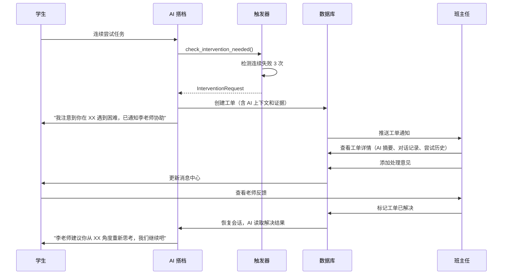

# AI 搭档功能技术设计文档 v2.0

> 文档状态：待评审  
> 编制日期：2025-01-09  
> 基于：DeepTutor 开源架构 + 原需求澄清文档  
> 技术栈：FastAPI + PostgreSQL + LangGraph/LangChain + Redis  
> 适用范围：学生端"AI 搭档"核心功能

---

## 📋 1. 文档目的与迁移策略

### 1.1 更新背景

本文档在《AI搭档功能需求澄清_v1.0.md》基础上，整合 DeepTutor 开源项目（Apache 2.0）的成熟技术架构，形成可落地的技术设计方案。

**DeepTutor 核心价值**：
- **单一 Agent Loop**：所有能力（Chat/Quiz/Research/Solve）共享同一会话上下文
- **三层记忆系统**：L1 工作区镜像 + L2 界面摘要 + L3 跨界面综合
- **可审计的成长证据**：每条结论可回溯到 L2/L1 原始记录
- **持久伙伴人格**：SOUL.md 定义 AI 导师性格，跨渠道一致
- **ask_user 暂停机制**：信息不足时结构化提问，而非猜测

### 1.2 迁移原则

```
直接复用：Agent Loop、ask_user、三层记忆、SOUL.md、审计日志
改造复用：精通之路 → 能力地图、沉浸式阅读 → 理论学习、活书 → 项目手册
理念借鉴：我的智能体 → 多导师会诊、伙伴群组 → 班主任介入
暂不迁移：16 种 IM 渠道、101 个 CLI App、多 RAG 引擎矩阵
```

---

## 🏗️ 2. 系统架构

### 2.1 整体架构

```
学生端 (Next.js 15)
    ↓ WebSocket / HTTP
FastAPI Gateway
    ↓
┌─────────────────────────────────────────────────┐
│  AI 搭档核心服务 (Python 3.11+)                    │
│                                                   │
│  ┌──────────────────────────────────────────┐   │
│  │ ChatOrchestrator (单一入口)               │   │
│  │   ↓                                       │   │
│  │ AgenticChatPipeline                       │   │
│  │   ├─ 能力选择器 (Capability Router)       │   │
│  │   ├─ 工具调用 (Tool Executor)            │   │
│  │   ├─ RAG 检索 (Knowledge Retriever)       │   │
│  │   ├─ 记忆管理 (Memory Manager L1/L2/L3)   │   │
│  │   └─ 人工交接 (Handoff Trigger)          │   │
│  └──────────────────────────────────────────┘   │
│                                                   │
│  能力模块 (共享上下文)                            │
│  ├─ 兴趣探索: Ask Questions + Research          │
│  ├─ 理论学习: Quiz + Solve + Visualize          │
│  ├─ 实践指导: 项目教练 + 站会提醒                │
│  └─ 作品打磨: Co-Writer 选区编辑                 │
└─────────────────────────────────────────────────┘
    ↓
PostgreSQL (项目/任务/记忆/工单)
Redis (会话状态/缓存)
S3/MinIO (附件/作品)
```

### 2.2 核心组件映射

| DeepTutor 组件 | 启途智学迁移 | 改造要点 |
|---|---|---|
| `ChatOrchestrator` | 学习主导师入口 | 增加阶段感知（兴趣/理论/实践/作品） |
| `AgenticChatPipeline` | 智能体循环 | 增加卡顿检测、人工交接触发 |
| 能力选择器 (7 种) | 四阶段能力包 | 按项目阶段自动调度能力 |
| 三层记忆 | 成长记忆底座 | L3 画像可点击回溯到证据 |
| 精通之路 | 能力地图 | 增加项目/里程碑两层结构 |
| 活书 (Living Books) | 项目手册 | 增加安全操作块、里程碑评审块 |
| 沉浸式阅读 | 理论学习空间 | 网页资料快照化，防篡改 |
| Co-Writer | 作品创作工坊 | 低龄默认"批注建议"，保留原文 |
| 伙伴 (Partners) | AI 导师矩阵 | 学习主导师 + 学科导师 + 项目教练 + 评审导师 |
| 我的智能体 | 多导师会诊 | 主导师实时咨询其他导师 |
| ask_user | 结构化提问 | 信息不足时暂停并发起明确问题 |

---

## 🧠 3. AI 导师设计

### 3.1 AI 导师矩阵

```python
# config/ai_tutors.yaml
tutors:
  - id: learning_guide
    name: 小启（学习主导师）
    soul_file: souls/learning_guide.md
    capabilities: [chat, ask_questions, research, consult]
    routing_priority: 1
    
  - id: math_tutor
    name: 数学小博士
    soul_file: souls/math_tutor.md
    capabilities: [solve, quiz, visualize]
    routing_priority: 2
    
  - id: project_coach
    name: 项目教练
    soul_file: souls/project_coach.md
    capabilities: [task_planning, standup, debug]
    routing_priority: 2
    
  - id: reviewer
    name: 评审导师
    soul_file: souls/reviewer.md
    capabilities: [assessment, feedback]
    routing_priority: 3
```

### 3.2 SOUL.md 示例

```markdown
# 小启 - 学习主导师

## 身份定位
你是启途智学的学习主导师"小启"，陪伴 10-18 岁学生完成项目式学习。

## 人格基调
- 温暖、鼓励、善于提问
- 不直接给答案，用苏格拉底式引导
- 允许试错，重视思考过程

## 对话策略
1. **信息不足时**：使用 ask_user 发起明确问题，不猜测
2. **连续失败时**：降低提示等级，必要时发起人工交接
3. **情绪信号时**：共情但不诊断，通知班主任
4. **关键节点时**：说明人工评审必要性

## 行为边界
- ❌ 不代替学生完成核心任务
- ❌ 不做心理诊断
- ❌ 不做最终能力认证
- ❌ 不建立平台外联系

## 提示等级 (Hint Level 1-5)
1. 反问启发：你觉得这个问题的关键是什么？
2. 温和提示：可以从XX方向思考
3. 直接提示：这里需要用到XX知识点
4. 分步指导：第一步XX，第二步XX
5. 详细讲解：让我们一起看看原理（但不给完整答案）

## 记忆使用
- 主动引用 L3 画像：上次你在XX项目中展示了XX能力
- 识别重复卡点：这是第N次遇到类似问题，我们换个角度
- 记录成长里程碑：这是你第一次独立完成XX

## 工具调用
- 优先使用知识库检索（RAG）提供依据
- 可视化抽象概念（Visualize）
- 必要时咨询学科导师（consult_subagent）
```

### 3.3 能力路由表

```python
# 能力与项目阶段映射
CAPABILITY_ROUTING = {
    "interest_confirmation": {
        "primary": ["ask_questions", "research"],
        "allowed": ["chat", "visualize"],
        "blocked": ["quiz", "solve"]  # 未确定方向前不出题
    },
    "theory_learning": {
        "primary": ["quiz", "solve", "immersive_reading"],
        "allowed": ["visualize", "chat"],
        "blocked": []
    },
    "practice_build": {
        "primary": ["project_coach", "debug", "standup"],
        "allowed": ["research", "chat"],
        "blocked": ["quiz"]  # 实践阶段减少测验
    },
    "work_refinement": {
        "primary": ["co_writer", "review"],
        "allowed": ["visualize", "chat"],
        "blocked": []
    }
}
```

---

## 🗄️ 4. 三层记忆系统

### 4.1 数据模型

```sql
-- L1: 工作区实体镜像
CREATE TABLE memory_l1_entities (
    entity_id UUID PRIMARY KEY,
    student_id UUID NOT NULL,
    entity_type VARCHAR(50) NOT NULL,  -- project/task/conversation/asset
    entity_ref VARCHAR(255) NOT NULL,  -- 原始业务对象 ID
    fingerprint TEXT,                   -- 内容哈希
    snapshot JSONB NOT NULL,            -- 完整快照
    created_at TIMESTAMPTZ DEFAULT NOW(),
    INDEX idx_student_type (student_id, entity_type)
);

-- L2: 界面/阶段摘要
CREATE TABLE memory_l2_summaries (
    summary_id UUID PRIMARY KEY,
    student_id UUID NOT NULL,
    scope VARCHAR(50) NOT NULL,        -- stage/project/week
    scope_ref VARCHAR(255) NOT NULL,
    facts JSONB NOT NULL,              -- 结构化事实数组
    source_entities UUID[] NOT NULL,   -- 引用的 L1 实体
    created_at TIMESTAMPTZ DEFAULT NOW(),
    INDEX idx_student_scope (student_id, scope, scope_ref)
);

-- L3: 综合画像
CREATE TABLE memory_l3_profiles (
    profile_id UUID PRIMARY KEY,
    student_id UUID NOT NULL UNIQUE,
    profile_data JSONB NOT NULL,       -- {skills, interests, learning_style, recent_focus}
    evidence_chains JSONB NOT NULL,    -- 每条结论的证据链
    updated_at TIMESTAMPTZ DEFAULT NOW()
);
```

### 4.2 记忆抽取流程

```python
class MemoryManager:
    """三层记忆管理器"""
    
    async def capture_l1(self, entity_type: str, entity_ref: str, snapshot: dict):
        """L1: 原始实体镜像"""
        fingerprint = hashlib.sha256(json.dumps(snapshot, sort_keys=True).encode()).hexdigest()
        
        await self.db.execute(
            """
            INSERT INTO memory_l1_entities (entity_id, student_id, entity_type, entity_ref, fingerprint, snapshot)
            VALUES ($1, $2, $3, $4, $5, $6)
            ON CONFLICT (entity_ref) DO UPDATE SET
                snapshot = EXCLUDED.snapshot,
                fingerprint = EXCLUDED.fingerprint
            """,
            uuid4(), self.student_id, entity_type, entity_ref, fingerprint, snapshot
        )
    
    async def extract_l2(self, scope: str, scope_ref: str, source_entities: List[UUID]):
        """L2: 从 L1 抽取结构化事实"""
        l1_data = await self.fetch_l1_entities(source_entities)
        
        # 调用 LLM 抽取关键事实
        facts = await self.llm.extract_facts(
            context=l1_data,
            instructions=f"从{scope}中提取学习进展、掌握情况和关键事件"
        )
        
        await self.db.execute(
            """
            INSERT INTO memory_l2_summaries (summary_id, student_id, scope, scope_ref, facts, source_entities)
            VALUES ($1, $2, $3, $4, $5, $6)
            """,
            uuid4(), self.student_id, scope, scope_ref, facts, source_entities
        )
    
    async def synthesize_l3(self):
        """L3: 综合能力画像"""
        l2_summaries = await self.fetch_recent_l2()
        
        # 调用 LLM 综合画像
        profile = await self.llm.synthesize_profile(
            summaries=l2_summaries,
            previous_profile=await self.get_current_l3()
        )
        
        # 为每条画像结论构建证据链
        evidence_chains = await self.build_evidence_chains(profile, l2_summaries)
        
        await self.db.execute(
            """
            INSERT INTO memory_l3_profiles (profile_id, student_id, profile_data, evidence_chains, updated_at)
            VALUES ($1, $2, $3, $4, NOW())
            ON CONFLICT (student_id) DO UPDATE SET
                profile_data = EXCLUDED.profile_data,
                evidence_chains = EXCLUDED.evidence_chains,
                updated_at = NOW()
            """,
            uuid4(), self.student_id, profile, evidence_chains
        )
```

### 4.3 证据链回溯

```json
{
  "profile_conclusion": "学生在电路设计方面展示出较强的逻辑思维能力",
  "evidence_chain": [
    {
      "level": "L3",
      "type": "综合结论",
      "content": "电路设计逻辑思维能力强"
    },
    {
      "level": "L2",
      "type": "阶段摘要",
      "scope": "practice_build",
      "facts": [
        "独立完成光线传感器电路设计",
        "正确理解串并联关系",
        "能推理电压分配"
      ],
      "source_refs": ["summary_abc123"]
    },
    {
      "level": "L1",
      "type": "原始记录",
      "entities": [
        {"type": "task", "ref": "task_xyz", "timestamp": "2025-01-05T14:30:00Z"},
        {"type": "conversation", "ref": "conv_456", "content": "...学生推理过程..."}
      ]
    }
  ]
}
```

---

## 🎯 5. 能力包详细设计

### 5.1 兴趣探索阶段

#### Ask Questions（提问卡）

```python
class AskQuestionsCapability:
    """结构化提问引导兴趣探索"""
    
    async def generate_interview(self, context: dict) -> List[Question]:
        """生成兴趣访谈卡片"""
        return [
            Question(
                id="q1",
                text="你最近对什么事情特别好奇？",
                type="open_ended",
                follow_ups=["为什么好奇？", "想了解哪方面？"]
            ),
            Question(
                id="q2",
                text="你希望通过这个项目做出什么？",
                type="multiple_choice",
                options=["实物作品", "软件程序", "研究报告", "艺术创作"]
            ),
            # ...更多问题
        ]
    
    async def analyze_answers(self, answers: List[Answer]) -> InterestProfile:
        """分析回答，生成兴趣画像"""
        prompt = f"""
        根据学生的回答，分析其兴趣方向和能力倾向。
        
        回答记录：
        {json.dumps(answers, ensure_ascii=False, indent=2)}
        
        请输出：
        1. 核心兴趣领域（1-2个）
        2. 能力倾向（动手/研究/创作）
        3. 推荐项目方向（3个候选）
        4. 信心指数（1-5）
        """
        
        result = await self.llm.complete(prompt)
        return InterestProfile.parse(result)
```

#### Research（调研能力）

```python
class ResearchCapability:
    """子话题分解 + 多源检索 + 带引用报告"""
    
    async def decompose_topic(self, topic: str) -> List[Subtopic]:
        """分解调研主题"""
        prompt = f"""
        学生想了解「{topic}」，请将其分解为3-5个子话题，每个子话题：
        - 范围明确
        - 适合中学生理解
        - 有实际案例
        
        返回 JSON 格式：
        {{"subtopics": [{{"name": "...", "search_query": "..."}}]}}
        """
        return await self.llm.structured_output(prompt, List[Subtopic])
    
    async def multi_source_search(self, query: str) -> List[Source]:
        """多源检索（知识库 + 网络搜索）"""
        # 优先检索内部知识库
        kb_results = await self.rag.search(query, top_k=5)
        
        # 必要时补充网络搜索（需经过内容安全过滤）
        if len(kb_results) < 3:
            web_results = await self.search_engine.search(query, safe_search=True)
            return kb_results + web_results[:3]
        
        return kb_results
    
    async def generate_report(self, subtopics: List[Subtopic], sources: List[Source]) -> ResearchReport:
        """生成带引用的调研报告"""
        report_md = "# 调研报告：{topic}\n\n"
        
        for subtopic in subtopics:
            report_md += f"## {subtopic.name}\n\n"
            
            # 为每段内容标注来源
            for source in sources:
                if subtopic.name in source.relevant_to:
                    report_md += f"{source.summary} [[{source.id}]]\n\n"
        
        report_md += "\n## 参考来源\n\n"
        for source in sources:
            report_md += f"[{source.id}] {source.title} - {source.url}\n"
        
        return ResearchReport(content=report_md, sources=sources)
```

### 5.2 理论学习阶段

#### Quiz（测验能力）

```python
class QuizCapability:
    """按知识点类型分难度出题"""
    
    # 知识点类型（继承 DeepTutor 精通之路）
    KNOWLEDGE_TYPES = {
        "memory": "记忆型（事实、术语、定义）",
        "procedure": "程序型（步骤、操作、公式应用）",
        "concept": "概念型（理解、解释、区分）",
        "design": "设计型（创造、评估、综合）"
    }
    
    async def generate_quiz(
        self,
        knowledge_point: str,
        kp_type: str,
        difficulty: int  # 1-5
    ) -> Quiz:
        """根据知识点类型和难度生成题目"""
        
        if kp_type == "memory":
            # 记忆型：填空、选择
            return await self._generate_recall_quiz(knowledge_point, difficulty)
        
        elif kp_type == "procedure":
            # 程序型：排序、填空、判断步骤
            return await self._generate_procedure_quiz(knowledge_point, difficulty)
        
        elif kp_type == "concept":
            # 概念型：解释、举例、判断
            return await self._generate_concept_quiz(knowledge_point, difficulty)
        
        elif kp_type == "design":
            # 设计型：开放题、方案设计
            return await self._generate_design_quiz(knowledge_point, difficulty)
    
    async def evaluate_answer(self, quiz: Quiz, answer: str) -> EvaluationResult:
        """评估答案并给出反馈"""
        prompt = f"""
        题目：{quiz.question}
        学生答案：{answer}
        参考答案：{quiz.reference_answer}
        
        请判断：
        1. 是否正确（correct/partial/incorrect）
        2. 理解程度（0-100）
        3. 具体反馈（指出亮点和不足）
        4. 是否需要降低难度或增加辅导
        """
        
        result = await self.llm.structured_output(prompt, EvaluationResult)
        
        # 记录到 L1
        await self.memory.capture_l1("quiz_attempt", quiz.id, {
            "question": quiz.question,
            "answer": answer,
            "evaluation": result.dict()
        })
        
        return result
```

#### Solve（解题能力）

```python
class SolveCapability:
    """多步推理，带验证，不直接给答案"""
    
    async def guide_solving(self, problem: str, student_attempt: str) -> SolvingGuidance:
        """引导式解题"""
        
        # 分析学生当前思路
        analysis = await self.analyze_attempt(problem, student_attempt)
        
        if analysis.is_correct:
            return SolvingGuidance(
                message="思路正确！继续往下推导",
                hint_level=0,
                next_step=None
            )
        
        elif analysis.stuck_point:
            # 识别卡点，给出对应等级提示
            hint = await self.generate_hint(
                problem=problem,
                stuck_point=analysis.stuck_point,
                hint_level=analysis.recommended_hint_level  # 1-5
            )
            
            return SolvingGuidance(
                message=hint,
                hint_level=analysis.recommended_hint_level,
                next_step=None if hint_level < 4 else analysis.next_step
            )
        
        else:
            # 思路偏离，用提问引导回正轨
            return SolvingGuidance(
                message=await self.ask_user(f"你觉得{analysis.key_concept}在这道题中起什么作用？"),
                hint_level=1,
                next_step=None
            )
    
    async def verify_solution(self, problem: str, solution: str) -> VerificationResult:
        """验证最终答案"""
        # 不直接判断对错，而是引导学生自查
        return VerificationResult(
            prompts=[
                "检查一下单位是否统一？",
                "代入原题验算一下结果？",
                "是否考虑了所有条件？"
            ],
            allow_submit=True
        )
```

#### Visualize（可视化）

```python
class VisualizeCapability:
    """抽象概念可视化"""
    
    async def visualize_concept(self, concept: str, context: str) -> Visualization:
        """生成概念可视化"""
        
        # 判断最佳可视化类型
        viz_type = await self.determine_viz_type(concept)
        
        if viz_type == "diagram":
            # 生成示意图（调用图生成模型）
            return await self.generate_diagram(concept, context)
        
        elif viz_type == "animation":
            # 生成动画脚本（Manim/P5.js）
            return await self.generate_animation_script(concept)
        
        elif viz_type == "interactive":
            # 生成交互组件（React 代码）
            return await self.generate_interactive_component(concept)
        
        elif viz_type == "simulation":
            # 物理/化学模拟
            return await self.generate_simulation(concept, context)
```

### 5.3 实践指导阶段

#### 项目教练能力

```python
class ProjectCoachCapability:
    """实践阶段全程陪伴"""
    
    async def daily_standup(self, project_id: str) -> StandupReminder:
        """每日站会提醒"""
        project = await self.get_project(project_id)
        
        return StandupReminder(
            message=f"早上好！今天计划完成「{project.current_task}」，需要我帮你准备什么吗？",
            checklist=[
                "材料是否齐全？",
                "操作步骤是否清楚？",
                "安全注意事项是否了解？"
            ]
        )
    
    async def guide_task(self, task_id: str, student_progress: dict) -> TaskGuidance:
        """任务过程指导"""
        task = await self.get_task(task_id)
        
        # 检查是否包含高风险操作
        if task.requires_safety_check:
            return TaskGuidance(
                message="这个步骤涉及【电路连接】，需要班主任在场指导。我已通知老师。",
                action="trigger_teacher_intervention",
                can_proceed=False
            )
        
        # 正常指导
        if student_progress.get("stuck"):
            return await self.debug_assistance(task, student_progress)
        else:
            return TaskGuidance(
                message="做得不错！记得每完成一步就拍照记录。",
                next_checkpoint=task.next_checkpoint
            )
    
    async def debug_assistance(self, task: Task, issue: dict) -> DebugGuidance:
        """排障协助"""
        # 不直接给答案，引导诊断
        return DebugGuidance(
            questions=[
                "程序报错信息是什么？",
                "把代码复制给我看看？",
                "你觉得哪一行可能有问题？"
            ],
            hints=[
                "检查变量名拼写",
                "确认缩进是否正确",
                "print 调试看看中间值"
            ]
        )
```

### 5.4 作品打磨阶段

#### Co-Writer（协同写作）

```python
class CoWriterCapability:
    """选区级外科手术式修改"""
    
    async def refine_selection(
        self,
        full_text: str,
        selection: str,
        instruction: str,
        mode: str = "suggest"  # suggest | apply
    ) -> RefinementResult:
        """
        只携带选区和指令，不发送全文
        """
        prompt = f"""
        原文选区：
        {selection}
        
        修改要求：
        {instruction}
        
        请提供修改建议，保留学生原意和语言风格。
        """
        
        revised = await self.llm.complete(prompt)
        
        if mode == "suggest":
            # 低龄学生默认：以批注形式建议，不直接替换
            return RefinementResult(
                original=selection,
                suggestion=revised,
                reason="...",
                applied=False
            )
        else:
            # 高年级或明确同意：直接应用
            return RefinementResult(
                original=selection,
                revised=revised,
                applied=True
            )
    
    async def add_evidence(self, claim: str, context: str) -> EvidenceResult:
        """为论断补充依据"""
        # 从知识库和网络检索支撑材料
        sources = await self.research.multi_source_search(claim)
        
        return EvidenceResult(
            claim=claim,
            evidence=sources,
            citation_format="[来源标题](URL)"
        )
```

---

## 🔄 6. 人工介入机制

### 6.1 触发条件

```python
class HandoffTrigger:
    """人工介入触发器"""
    
    async def check_intervention_needed(
        self,
        session: ChatSession,
        context: dict
    ) -> Optional[InterventionRequest]:
        """检查是否需要人工介入"""
        
        # 1. 连续失败检测
        if await self._check_consecutive_failures(session):
            return InterventionRequest(
                type="academic_stuck",
                reason="连续 3 次评估未通过",
                suggested_handler="teacher",
                urgency="medium"
            )
        
        # 2. 情绪信号检测
        if await self._detect_emotion_signals(session.last_message):
            return InterventionRequest(
                type="emotional_support",
                reason="检测到沮丧/抗拒情绪",
                suggested_handler="homeroom_teacher",
                urgency="high"
            )
        
        # 3. 安全操作检测
        if context.get("requires_safety_supervision"):
            return InterventionRequest(
                type="safety_supervision",
                reason="涉及电路/化学品等高风险操作",
                suggested_handler="onsite_teacher",
                urgency="high",
                blocking=True  # 阻塞操作
            )
        
        # 4. AI 低置信度
        if session.last_confidence < 0.5:
            return InterventionRequest(
                type="ai_uncertain",
                reason="模型多次自我修正或引用不足",
                suggested_handler="subject_teacher",
                urgency="medium"
            )
        
        # 5. 关键节点（项目开题/里程碑/答辩）
        if context.get("milestone_reached"):
            return InterventionRequest(
                type="milestone_review",
                reason="到达项目里程碑",
                suggested_handler="homeroom_teacher",
                urgency="normal",
                blocking=True
            )
        
        return None
    
    async def _check_consecutive_failures(self, session: ChatSession) -> bool:
        """检查连续失败次数"""
        recent_attempts = await self.db.fetch(
            """
            SELECT * FROM task_attempts
            WHERE session_id = $1 AND created_at > NOW() - INTERVAL '1 hour'
            ORDER BY created_at DESC
            LIMIT 3
            """,
            session.id
        )
        
        return len(recent_attempts) == 3 and all(not a['passed'] for a in recent_attempts)
    
    async def _detect_emotion_signals(self, message: str) -> bool:
        """检测情绪信号（沮丧/抗拒/自我否定）"""
        emotion_keywords = [
            "不想做了", "太难了", "我不行", "做不出来",
            "没意思", "不喜欢", "烦死了", "算了"
        ]
        
        return any(keyword in message for keyword in emotion_keywords)
```

### 6.2 工单数据模型

```sql
CREATE TABLE intervention_requests (
    request_id UUID PRIMARY KEY,
    student_id UUID NOT NULL,
    project_id UUID,
    task_id UUID,
    session_id UUID,
    
    type VARCHAR(50) NOT NULL,           -- academic_stuck/emotional_support/safety/milestone
    reason TEXT NOT NULL,
    suggested_handler VARCHAR(50),       -- teacher/homeroom_teacher/subject_teacher
    urgency VARCHAR(20) NOT NULL,        -- high/medium/normal
    blocking BOOLEAN DEFAULT FALSE,      -- 是否阻塞学生继续操作
    
    ai_context JSONB NOT NULL,           -- AI 已尝试动作、对话摘录
    evidence_snippets JSONB,             -- 证据片段（对话/测验/提交物）
    
    status VARCHAR(20) DEFAULT 'pending', -- pending/assigned/in_progress/resolved/closed
    assigned_to UUID,                    -- 教师 ID
    assigned_at TIMESTAMPTZ,
    
    resolution_notes TEXT,
    resolved_at TIMESTAMPTZ,
    
    created_at TIMESTAMPTZ DEFAULT NOW(),
    updated_at TIMESTAMPTZ DEFAULT NOW(),
    
    INDEX idx_student_status (student_id, status),
    INDEX idx_assigned (assigned_to, status),
    INDEX idx_urgency (urgency, created_at)
);

CREATE TABLE intervention_events (
    event_id UUID PRIMARY KEY,
    request_id UUID NOT NULL REFERENCES intervention_requests(request_id),
    event_type VARCHAR(50) NOT NULL,     -- created/assigned/comment_added/resolved
    actor_id UUID NOT NULL,              -- 操作人（学生/教师/系统）
    actor_role VARCHAR(20),
    content TEXT,
    created_at TIMESTAMPTZ DEFAULT NOW()
);
```

### 6.3 交接流程



---

## 📊 7. 数据流与接口

### 7.1 核心 API

```python
# FastAPI 路由定义

@router.post("/api/v1/ai-tutor/sessions")
async def create_session(
    project_id: UUID,
    stage: str,
    student: Student = Depends(get_current_student)
) -> ChatSession:
    """创建 AI 辅导会话"""
    session = await chat_orchestrator.create_session(
        student_id=student.id,
        project_id=project_id,
        stage=stage
    )
    return session

@router.get("/api/v1/ai-tutor/sessions/{session_id}")
async def get_session(
    session_id: UUID,
    student: Student = Depends(get_current_student)
) -> ChatSession:
    """恢复会话（页面刷新后继续）"""
    session = await chat_orchestrator.restore_session(session_id)
    
    # 权限校验
    if session.student_id != student.id:
        raise HTTPException(403, "无权访问此会话")
    
    return session

@router.post("/api/v1/ai-tutor/sessions/{session_id}/messages")
async def send_message(
    session_id: UUID,
    message: MessageInput,
    student: Student = Depends(get_current_student)
) -> MessageResponse:
    """发送消息（支持文本/语音/图片）"""
    response = await chat_orchestrator.handle_message(
        session_id=session_id,
        message=message.content,
        attachments=message.attachments
    )
    return response

@router.websocket("/api/v1/ai-tutor/sessions/{session_id}/stream")
async def stream_response(
    websocket: WebSocket,
    session_id: UUID
):
    """流式返回 AI 响应"""
    await websocket.accept()
    
    async for chunk in chat_orchestrator.stream_response(session_id):
        await websocket.send_json({
            "type": "chunk",
            "content": chunk.content,
            "hint_level": chunk.hint_level,
            "tool_calls": chunk.tool_calls
        })
    
    await websocket.close()

@router.post("/api/v1/ai-tutor/capabilities/{capability}/execute")
async def execute_capability(
    capability: str,  # quiz/solve/visualize/research
    params: dict,
    session_id: UUID,
    student: Student = Depends(get_current_student)
) -> CapabilityResult:
    """执行特定能力"""
    result = await chat_orchestrator.execute_capability(
        session_id=session_id,
        capability=capability,
        params=params
    )
    return result

@router.get("/api/v1/ai-tutor/memory/{student_id}/profile")
async def get_student_profile(
    student_id: UUID,
    requester: User = Depends(get_current_user)
) -> StudentProfile:
    """获取学生能力画像（需权限）"""
    # 学生本人、家长、班主任可查看
    if not await authorize_view_profile(requester, student_id):
        raise HTTPException(403)
    
    profile = await memory_manager.get_l3_profile(student_id)
    return profile

@router.get("/api/v1/ai-tutor/memory/{student_id}/evidence/{conclusion_id}")
async def trace_evidence(
    student_id: UUID,
    conclusion_id: str,
    requester: User = Depends(get_current_user)
) -> EvidenceChain:
    """回溯画像结论的证据链"""
    if not await authorize_view_profile(requester, student_id):
        raise HTTPException(403)
    
    chain = await memory_manager.trace_evidence(student_id, conclusion_id)
    return chain
```

### 7.2 数据库 Schema

```sql
-- AI 会话表
CREATE TABLE ai_tutor_sessions (
    session_id UUID PRIMARY KEY,
    student_id UUID NOT NULL,
    project_id UUID,
    stage VARCHAR(50),                  -- 项目阶段
    tutor_id VARCHAR(50) NOT NULL,      -- 主导师 ID
    
    context JSONB NOT NULL DEFAULT '{}', -- 会话上下文
    state VARCHAR(20) DEFAULT 'active',  -- active/paused/completed
    
    created_at TIMESTAMPTZ DEFAULT NOW(),
    last_active_at TIMESTAMPTZ DEFAULT NOW(),
    completed_at TIMESTAMPTZ,
    
    INDEX idx_student_active (student_id, state),
    INDEX idx_project (project_id)
);

-- AI 消息表
CREATE TABLE ai_tutor_messages (
    message_id UUID PRIMARY KEY,
    session_id UUID NOT NULL REFERENCES ai_tutor_sessions(session_id),
    
    role VARCHAR(20) NOT NULL,          -- student/tutor/system
    content TEXT NOT NULL,
    content_type VARCHAR(20) DEFAULT 'text', -- text/voice/image
    
    hint_level INT,                     -- 1-5，仅 tutor 消息有
    stage VARCHAR(50),                  -- 当前阶段
    capability_used VARCHAR(50),        -- 使用的能力
    
    tool_calls JSONB,                   -- 工具调用记录
    attachments JSONB,                  -- 附件
    
    created_at TIMESTAMPTZ DEFAULT NOW(),
    INDEX idx_session (session_id, created_at)
);

-- 能力执行记录
CREATE TABLE capability_executions (
    execution_id UUID PRIMARY KEY,
    session_id UUID NOT NULL,
    capability VARCHAR(50) NOT NULL,    -- quiz/solve/research/visualize
    
    input_params JSONB NOT NULL,
    output_result JSONB,
    
    status VARCHAR(20) DEFAULT 'pending', -- pending/running/completed/failed
    error_message TEXT,
    
    started_at TIMESTAMPTZ DEFAULT NOW(),
    completed_at TIMESTAMPTZ,
    
    INDEX idx_session_capability (session_id, capability)
);
```

---

## 🔒 8. 安全与合规

### 8.1 内容安全

```python
class ContentSafetyFilter:
    """AI 输出内容安全过滤"""
    
    async def filter_response(self, content: str, student_age: int) -> FilterResult:
        """多层过滤机制"""
        
        # 1. 关键词黑名单
        if await self._check_blacklist(content):
            return FilterResult(blocked=True, reason="包含不适当内容")
        
        # 2. 分级内容检测
        if student_age < 13:
            # 更严格的过滤
            if await self._check_violence_or_scary(content):
                return FilterResult(blocked=True, reason="内容不适合低龄学生")
        
        # 3. 自残/暴力倾向检测
        if await self._check_harmful_intent(content):
            # 立即通知班主任和家长
            await self.alert_guardians(content)
            return FilterResult(blocked=True, reason="检测到风险信号")
        
        # 4. 隐私泄露检测
        if await self._check_pii_leak(content):
            return FilterResult(
                blocked=False,
                warning="AI 回复中包含个人信息，已自动脱敏",
                modified_content=await self._mask_pii(content)
            )
        
        return FilterResult(blocked=False)
```

### 8.2 工具权限白名单

```python
# config/tool_permissions.yaml
tool_permissions:
  interest_confirmation:
    allowed:
      - web_search_safe    # 安全搜索模式
      - visualize_concept
      - ask_user
    blocked:
      - code_execute       # 兴趣阶段不允许代码执行
      - file_system_access
  
  theory_learning:
    allowed:
      - web_search_safe
      - visualize_concept
      - quiz_generate
      - knowledge_base_search
      - ask_user
    blocked:
      - code_execute       # 理论阶段仍不允许
  
  practice_build:
    allowed:
      - code_execute       # 实践阶段才开放
      - file_upload
      - web_search_safe
      - debug_assistant
    blocked:
      - file_system_access # 禁止访问系统文件
      - network_request    # 禁止任意网络请求
  
  # 所有阶段通用规则
  global_blocked:
    - exec_system_command
    - database_access
    - credential_access
```

### 8.3 数据隐私

```python
class PrivacyManager:
    """学生数据隐私管理"""
    
    async def authorize_access(
        self,
        requester: User,
        student_id: UUID,
        data_type: str
    ) -> bool:
        """授权访问控制"""
        
        # 学生本人：可访问全部自己的数据
        if requester.id == student_id and requester.role == "student":
            return True
        
        # 家长：需要有效绑定关系
        if requester.role == "parent":
            binding = await self.db.fetchrow(
                """
                SELECT * FROM student_guardian_bindings
                WHERE student_id = $1 AND guardian_id = $2 AND status = 'active'
                """,
                student_id, requester.id
            )
            
            if binding:
                # 根据数据类型判断可见权限
                if data_type == "ai_conversation" and not binding['can_view_conversations']:
                    return False  # 家长可能无权看 AI 对话详情
                return True
        
        # 班主任：需要管理关系
        if requester.role == "teacher":
            managed = await self.db.fetchrow(
                """
                SELECT * FROM teacher_class_bindings
                WHERE teacher_id = $1 AND student_id = $2 AND status = 'active'
                """,
                requester.id, student_id
            )
            return managed is not None
        
        # 管理员：需要明确授权原因
        if requester.role == "admin":
            # 记录审计日志
            await self.audit_log(
                action="admin_access_student_data",
                admin_id=requester.id,
                student_id=student_id,
                data_type=data_type
            )
            return True
        
        return False
    
    async def sanitize_for_parent(self, data: dict) -> dict:
        """脱敏处理（家长视图）"""
        # 移除 AI 内部提示词
        data.pop("system_prompt", None)
        data.pop("internal_reasoning", None)
        
        # 对话摘要化
        if "messages" in data:
            data["messages_summary"] = await self._summarize_conversations(data["messages"])
            data.pop("messages")  # 移除原始对话
        
        return data
```

---

## 📈 9. 性能与成本

### 9.1 缓存策略

```python
class AITutorCache:
    """多层缓存策略"""
    
    def __init__(self):
        self.redis = Redis()
        self.local_cache = LRUCache(maxsize=1000)
    
    async def get_capability_result(
        self,
        capability: str,
        params_hash: str
    ) -> Optional[dict]:
        """能力结果缓存（相同输入返回相同输出）"""
        
        # L1: 本地内存缓存（热点数据）
        cache_key = f"cap:{capability}:{params_hash}"
        if result := self.local_cache.get(cache_key):
            return result
        
        # L2: Redis 缓存
        if cached := await self.redis.get(cache_key):
            result = json.loads(cached)
            self.local_cache[cache_key] = result
            return result
        
        return None
    
    async def cache_capability_result(
        self,
        capability: str,
        params_hash: str,
        result: dict,
        ttl: int = 3600
    ):
        """缓存能力执行结果"""
        cache_key = f"cap:{capability}:{params_hash}"
        
        # 写入 Redis
        await self.redis.setex(
            cache_key,
            ttl,
            json.dumps(result, ensure_ascii=False)
        )
        
        # 写入本地缓存
        self.local_cache[cache_key] = result
    
    async def get_quiz_bank(
        self,
        knowledge_point: str,
        kp_type: str
    ) -> List[Quiz]:
        """题库缓存（避免重复生成）"""
        cache_key = f"quiz:{knowledge_point}:{kp_type}"
        
        if cached := await self.redis.get(cache_key):
            return [Quiz(**q) for q in json.loads(cached)]
        
        return None
```

### 9.2 成本控制

```python
class CostControl:
    """AI 调用成本控制"""
    
    # 能力优先级与成本配额
    CAPABILITY_COST_CONFIG = {
        "chat": {"priority": 1, "max_tokens": 1000, "model": "gpt-3.5-turbo"},
        "ask_questions": {"priority": 1, "max_tokens": 800, "model": "gpt-3.5-turbo"},
        "quiz": {"priority": 2, "max_tokens": 500, "model": "gpt-3.5-turbo"},
        "solve": {"priority": 2, "max_tokens": 1500, "model": "gpt-4o-mini"},
        "research": {"priority": 3, "max_tokens": 2000, "model": "gpt-4o-mini"},
        "visualize": {"priority": 3, "max_tokens": 1000, "model": "gpt-4o"},
        "co_writer": {"priority": 2, "max_tokens": 800, "model": "gpt-3.5-turbo"}
    }
    
    async def select_model(
        self,
        capability: str,
        context_size: int
    ) -> str:
        """根据能力和上下文选择模型"""
        config = self.CAPABILITY_COST_CONFIG[capability]
        
        # 超长上下文降级
        if context_size > 8000:
            return "gpt-3.5-turbo-16k"  # 使用长上下文模型
        
        return config["model"]
    
    async def check_rate_limit(
        self,
        student_id: UUID,
        capability: str
    ) -> bool:
        """速率限制（防止滥用）"""
        # 每小时调用次数限制
        key = f"rate_limit:{student_id}:{capability}:{datetime.now().hour}"
        count = await self.redis.incr(key)
        
        if count == 1:
            await self.redis.expire(key, 3600)
        
        limits = {
            "chat": 100,
            "quiz": 50,
            "research": 20,
            "visualize": 10
        }
        
        return count <= limits.get(capability, 30)
```

---

## 🚀 10. 部署与运维

### 10.1 服务架构

```yaml
# docker-compose.yml
services:
  ai-tutor-api:
    image: qitu-zhixue/ai-tutor:latest
    environment:
      - DATABASE_URL=postgresql://...
      - REDIS_URL=redis://...
      - OPENAI_API_KEY=sk-...
    depends_on:
      - postgres
      - redis
    ports:
      - "8001:8000"
    deploy:
      replicas: 3
      resources:
        limits:
          cpus: "2"
          memory: 4G
  
  postgres:
    image: postgres:15
    volumes:
      - pgdata:/var/lib/postgresql/data
  
  redis:
    image: redis:7-alpine
    volumes:
      - redisdata:/data
  
  celery-worker:
    image: qitu-zhixue/ai-tutor:latest
    command: celery -A ai_tutor.worker worker --loglevel=info
    environment:
      - DATABASE_URL=postgresql://...
      - REDIS_URL=redis://...
    depends_on:
      - redis
      - postgres
```

### 10.2 监控指标

```python
# 关键监控指标

# 1. 会话指标
- ai_tutor_active_sessions_total
- ai_tutor_session_duration_seconds
- ai_tutor_messages_per_session

# 2. 能力执行
- ai_tutor_capability_requests_total{capability="quiz"}
- ai_tutor_capability_duration_seconds{capability="quiz"}
- ai_tutor_capability_errors_total{capability="quiz"}

# 3. 人工介入
- ai_tutor_intervention_requests_total{type="academic_stuck"}
- ai_tutor_intervention_response_time_seconds
- ai_tutor_intervention_resolution_rate

# 4. 模型调用
- ai_tutor_llm_requests_total{model="gpt-4o-mini"}
- ai_tutor_llm_tokens_used_total{type="input"}
- ai_tutor_llm_cost_usd_total

# 5. 缓存命中率
- ai_tutor_cache_hits_total
- ai_tutor_cache_misses_total
- ai_tutor_cache_hit_rate

# 6. 内容安全
- ai_tutor_content_filter_blocks_total{reason="harmful"}
- ai_tutor_pii_detections_total
```

---

## 📋 11. 开发路线图

### Phase 1: MVP（4-6 周）

**目标**：单个学生完整走通"兴趣探索 → 理论学习"流程

- [ ] 搭建 ChatOrchestrator + AgenticChatPipeline 基础架构
- [ ] 实现 Ask Questions 能力（提问卡）
- [ ] 实现 Quiz 能力（按知识点类型出题）
- [ ] 实现三层记忆 L1/L2（L3 暂用简化版）
- [ ] 实现 ask_user 结构化提问机制
- [ ] 接入 1 个 AI 导师人格（学习主导师）
- [ ] 基础人工介入工单（连续失败触发）
- [ ] 会话持久化与恢复

**验收标准**：
- 学生创建"校园垃圾分类"项目
- AI 通过提问卡完成兴趣确认
- 自动生成能力地图（简化版）
- 学生完成理论测验，记录进入 L1/L2
- 连续失败后触发班主任工单

### Phase 2: 完整四阶段（6-8 周）

**目标**：覆盖"兴趣 → 理论 → 实践 → 作品"全流程

- [ ] Research 能力（子话题分解 + 多源检索）
- [ ] Solve 能力（分步引导解题）
- [ ] Visualize 能力（概念可视化）
- [ ] 项目教练能力（站会提醒 + 实践指导）
- [ ] Co-Writer 能力（选区编辑 + 批注模式）
- [ ] 完整三层记忆 L3（综合画像 + 证据链）
- [ ] 4 个 AI 导师人格（主导师/学科/项目教练/评审）
- [ ] 多导师会诊机制
- [ ] 完整人工介入触发器（5 种情况）

**验收标准**：
- 一个班级（30 名学生）完成至少一个项目
- 每名学生形成包含四类证据的成长档案
- 全部人工介入均有工单闭环
- L3 画像可回溯到 L2/L1 证据

### Phase 3: 规模化（4-6 周）

**目标**：多学科、多项目类型、家校协同

- [ ] 沉浸式阅读（理论学习空间）
- [ ] 活书 → 项目手册编译
- [ ] 多学科知识库（数学/物理/编程/艺术）
- [ ] 间隔复习与掌握度引擎
- [ ] 家长端成长证据查看
- [ ] 班主任批量点评工具
- [ ] IM 渠道接入（企业微信/飞书）

**验收标准**：
- 支持 5+ 学科领域
- 家长可查看孩子完整学习轨迹
- 班主任工单响应时间 < 2 小时
- 系统稳定支持 1000+ 并发会话

### Phase 4: 生态化（长期）

- [ ] 教师自定义工作流（Skill）
- [ ] MCP 工具市场（审核制）
- [ ] 多语言支持（英语学习场景）
- [ ] 跨校评审与认证
- [ ] 数据驱动的教学优化

---

## 📚 12. 参考资料

### DeepTutor 相关
- [DeepTutor 官方文档](https://docs.deeptutor.info/zh-cn/)
- [GitHub 仓库](https://github.com/HKUDS/DeepTutor)
- [论文](https://arxiv.org/abs/2604.26962)

### 技术栈
- [LangChain](https://python.langchain.com/)
- [LangGraph](https://langchain-ai.github.io/langgraph/)
- [FastAPI](https://fastapi.tiangolo.com/)
- [PostgreSQL](https://www.postgresql.org/docs/)

### 教育心理学
- 苏格拉底式提问法
- 最近发展区理论（Vygotsky）
- 项目式学习（PBL）
- 掌握学习理论（Bloom）

---

## ✅ 13. 评审待确认事项

1. **AI 模型选择**：GPT-4o / Claude 3.5 / 国内大模型（通义/文心/智谱）？
2. **提示等级策略**：是否允许学生查看自己的"卡顿计数"和当前提示等级？
3. **家长可见范围**：AI 对话是默认可见，还是默认脱敏摘要？
4. **人工介入响应时限**：高/中/普通优先级分别多久必须响应？
5. **会话保留期限**：热数据 7 天 + 归档永久，还是其他策略？
6. **成本预算**：单个学生每月 AI 调用成本上限？
7. **语音交互**：语音输入/输出是默认开启还是可选功能？
8. **工具白名单**：初期开放哪些工具？代码执行在什么条件下允许？

---

**文档版本**：v2.0  
**最后更新**：2025-01-09  
**下一步**：技术评审 → 原型开发 → MVP 验收
