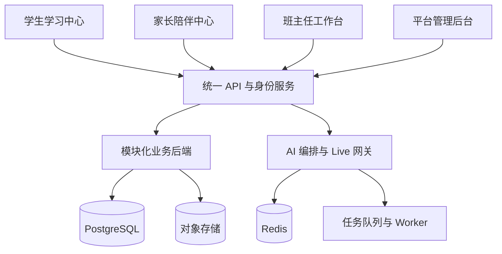

# AI教育平台前后端开发文档 v1.0

> 产品名称：AI时代孩子能力培养系统
>
> 文档状态：开发基线
>
> 适用范围：学生学习中心、家长陪伴中心、班主任工作台、平台管理后台
>
> UI基准：以已提供的全部前端界面图为准，不改变现有信息架构、导航关系和视觉框架。

---

## 0. 文档目标与固定约束

### 0.1 产品目标

通过 AI 导师、项目式学习和人工导师协同，帮助 10–18 岁学生完成从兴趣探索、理论学习、动手实践到作品沉淀的完整过程。家长查看孩子的学习轨迹和成长证据，班主任负责日常指导和人工介入，管理员负责平台治理。

### 0.2 四个平台

| 平台 | 代码名称 | 主要用户 | 核心职责 |
|---|---|---|---|
| 学生学习中心 | `student-center` | 学生 | 兴趣探索、AI 导师、项目学习、作品创作 |
| 家长陪伴中心 | `parent-companion` | 家长 | 查看孩子的学习过程、项目进度、成长记录和反馈 |
| 班主任工作台 | `teacher-workspace` | 平台导师/班主任 | 管理负责学生、处理问题、人工干预、复核项目 |
| 平台管理后台 | `admin-console` | 平台管理员 | 账户、关系、项目模板、AI 策略、模型、审计和系统设置 |

### 0.3 已冻结的 UI 页面

#### 学生学习中心

- `dashboard.png`：今天
- `灵感空间.png`：推荐项目
- `灵感空间2.png`：自由 Live 探索
- `AI导师.png`：AI 导师
- `我的项目.png`：项目列表
- `我的项目2.png`：项目制作工作台
- `作品展厅.png`：作品展厅

#### 家长陪伴中心

- `首页.png`：首页
- `学习进展.png`：学习进展
- `消息与反馈.png`：消息与反馈

#### 班主任工作台

- `工作台.png`：工作台
- `学生管理.png`：学生管理
- `问题处理.png`：问题处理
- `数据统计.png`：数据统计
- `系统设置.png`：现有系统设置基准

### 0.4 不改变的产品框架

- 学生端继续使用“今天、灵感空间、AI导师、我的项目、作品展厅”导航。
- 家长端继续使用“首页、学习进展、消息与反馈”导航。
- 班主任端继续使用“工作台、学生管理、问题处理、数据统计、知识库、系统设置”结构。
- 管理后台在现有系统设置视觉和壳层内扩展管理功能。
- 灵感空间分为“推荐项目”和“自由 Live 探索”两条业务路径，最终都创建统一的项目实例。
- 一个学生同一时间只能有一名当前班主任。
- 家长端显示脱敏成长快照和过程证据，不默认显示原始 AI 对话。
- AI 导师默认使用苏格拉底式提问，不直接代替学生完成项目。

---

# 1. 总体技术架构

## 1.1 架构原则

四个平台是四个独立前端应用，共享一套认证、API、数据模型和 AI 服务。首期使用模块化单体后端和异步任务，不提前拆成大量微服务。



## 1.2 推荐技术栈

| 层 | 技术建议 |
|---|---|
| 前端 | React、Next.js、TypeScript、Tailwind |
| 前端状态 | TanStack Query + Zustand |
| API | REST + OpenAPI 类型生成 |
| 流式交互 | SSE / WebSocket |
| 后端 | NestJS 或 FastAPI 模块化单体 |
| 主数据库 | PostgreSQL |
| 缓存 | Redis |
| 文件 | 私有对象存储，使用签名 URL |
| 异步任务 | BullMQ、RabbitMQ 或云队列 |
| 向量检索 | pgvector |
| 监控 | OpenTelemetry、结构化日志、错误追踪 |

## 1.3 代码仓库结构

```text
education-platform/
├── apps/
│   ├── student-center/
│   ├── parent-companion/
│   ├── teacher-workspace/
│   └── admin-console/
├── packages/
│   ├── ui/
│   ├── design-tokens/
│   ├── auth/
│   ├── permissions/
│   ├── contracts/
│   ├── api-client/
│   ├── realtime/
│   ├── ai-client/
│   ├── file-uploader/
│   ├── validation/
│   └── analytics/
├── services/
│   ├── api/
│   ├── workers/
│   └── realtime-gateway/
├── database/
│   ├── migrations/
│   ├── seeds/
│   └── fixtures/
├── docs/
└── tooling/
```

## 1.4 模块依赖规则

1. 四个前端只依赖 `packages` 和 API 合同，不互相导入业务代码。
2. 页面只负责组合模块，业务逻辑放入 `features`、`hooks` 和 `services`。
3. 前端权限只控制显示，后端必须执行对象级权限校验。
4. 核心业务规则只能由后端领域模块修改。
5. 跨平台调用统一使用 `contracts` 和 `api-client`。
6. AI、语音、项目状态转换不能由客户端直接写数据库。

---

# 2. 共享前端基础模块

## 2.1 `packages/design-tokens`

沿用现有 UI 视觉基线：

```ts
export const colors = {
  page: '#F6FAFF',
  primary: '#2878F0',
  heading: '#102A5C',
  completed: '#18B7AC',
  attention: '#FF8A3D',
  danger: '#E95B68',
  border: '#E4ECF7',
  text: '#243B5A',
  muted: '#73839B'
}
```

固定规则：

- 主背景以白色、浅蓝和山景背景为主。
- 标题使用深蓝色。
- 主要操作使用蓝色。
- 完成状态使用青绿色。
- 关注和待处理使用柔和橙色。
- 卡片圆角 6–8px。
- 使用轻阴影和规整栅格。
- 不引入深色霓虹、复杂渐变或监控式视觉。

## 2.2 `packages/ui`

```text
AppShell
SideNav
TopBar
PageHeader
StatCard
ProjectCard
ProgressBar
StageTimeline
StatusBadge
DataTable
RadarChart
LineChart
EmptyState
LoadingState
ErrorState
Modal
Drawer
Toast
ConfirmDialog
AudioButton
LiveComposer
MessageBubble
VoiceWaveform
FileUploader
FilterBar
Tag
```

## 2.3 `packages/auth`

负责：

- 登录和验证码
- 邀请链接
- 学生设备码
- Token 刷新
- 设备会话
- 退出登录
- 当前用户和角色
- MFA 状态

## 2.4 `packages/permissions`

```ts
canReadOwnProfile()
canReadChild(childId)
canReadAssignedStudent(studentId)
canWriteProject(projectId)
canSubmitArtifact(projectId)
canIntervene(studentId)
canManageUsers()
canManageAiPolicy()
canReadAuditLogs()
```

## 2.5 `packages/contracts`

统一维护：

```text
User
Role
Household
Student
GuardianLink
MentorAssignment
ProjectTemplate
RecommendationItem
ExplorationSession
IntentConfirmation
Project
ProjectStage
Task
TutorSession
TutorTurn
Artifact
GrowthSnapshot
Alert
Intervention
FeedbackTicket
Notification
```

---

# 3. 统一认证、角色和权限

## 3.1 角色

| 角色 | 说明 |
|---|---|
| `student` | 只能访问自己的学习数据 |
| `parent` | 只能访问已授权孩子的家长视图 |
| `teacher` | 只能访问当前分配给自己的学生 |
| `admin` | 管理平台账户、模板、配置和审计 |
| `support` | 可按工单查看必要信息 |

## 3.2 登录流程

### 家长

1. 手机号或邮箱验证码登录。
2. 创建家庭档案。
3. 绑定或创建孩子档案。
4. 完成监护授权和数据使用同意。

### 学生

1. 家长或管理员生成一次性邀请。
2. 学生使用设备码或临时凭证登录。
3. 首次登录后设置昵称和登录凭证。
4. 不要求学生提供手机号。

### 班主任

1. 管理员邀请注册。
2. 完成邮箱/手机号验证。
3. 强制开启 MFA。
4. 只能查看已分配学生。

### 管理员

1. 管理员邀请注册。
2. 强制 MFA。
3. 敏感配置和原始数据访问需要二次确认。

## 3.3 学生—班主任关系

```text
mentor_assignments
- id
- student_id
- mentor_id
- status
- assigned_at
- ended_at
- assigned_by
- reason
```

数据库约束：

```sql
CREATE UNIQUE INDEX one_active_mentor_per_student
ON mentor_assignments(student_id)
WHERE status = 'active';
```

转派必须使用事务，保留历史关系并写入审计日志。

## 3.4 权限原则

每一次请求都检查：

```text
角色权限
+ 资源归属
+ 家长授权状态
+ 当前班主任分配状态
+ 资源可见性
```

前端隐藏按钮不能代替后端权限控制。

---

# 4. 学生学习中心开发文档

## 4.1 路由

```text
/student/today
/student/inspiration
/student/inspiration/recommended/:id
/student/inspiration/explore
/student/inspiration/explore/:sessionId
/student/tutor
/student/projects
/student/projects/:projectId
/student/projects/:projectId/theory
/student/projects/:projectId/practice
/student/projects/:projectId/reflection
/student/works
/student/works/:artifactId
```

## 4.2 今日页面 `dashboard.png`

### 页面目标

让学生快速知道今天应该做什么，并继续上次未完成的学习。

### 前端模块

```text
features/today/
├── TodayHeader
├── ContinueProjectCard
├── TodayTaskCard
├── RecentWorks
├── LearningSummary
├── QuickStartLive
└── NotificationEntry
```

### 数据接口

```http
GET /api/v1/students/me/today
GET /api/v1/students/me/notifications?unread=true
GET /api/v1/students/me/active-project
```

### 页面状态

```text
loading
ready
empty
error
```

### 验收标准

- 页面结构和 `dashboard.png` 保持一致。
- 学生可以继续上次项目。
- 今日任务显示当前阶段任务。
- 无项目时显示进入灵感空间的入口。
- 语音入口可以启动 Live 探索。

## 4.3 灵感空间 `灵感空间.png`、`灵感空间2.png`

### 页面结构

灵感空间分为两个区域：

1. 推荐项目
2. 自由 Live 探索

推荐项目使用项目卡片展示，不能和正式项目混在一起。自由探索使用 Live 对话入口。

### 前端模块

```text
features/inspiration/
├── RecommendedProjectList
├── ProjectCard
├── RecommendationReason
├── InterestTag
├── FreeExploreEntry
├── LivePanel
├── IntentCandidateCard
├── IntentConfirmDialog
└── ProjectDirectionCard
```

### 推荐项目接口

```http
GET /api/v1/inspiration/recommendations
GET /api/v1/project-templates/:id
POST /api/v1/recommendations/:id/start
POST /api/v1/recommendations/:id/decline
```

### 自由探索接口

```http
POST /api/v1/explorations
GET /api/v1/explorations/:id
POST /api/v1/explorations/:id/turns
POST /api/v1/explorations/:id/confirm-intent
POST /api/v1/explorations/:id/close
```

### 状态

```text
idle
listening
transcribing
clarifying
awaiting_confirmation
confirmed
paused
reconnecting
ended
```

### 核心规则

- 学生没有明确确认时，不创建正式项目。
- 推荐项目和自由探索可以共用 AI 导师，但必须保留来源类型。
- 推荐项目确认后引用固定的模板版本。
- 自由探索确认后生成项目方向卡，再创建项目实例。
- AI 生成的兴趣变化不能直接覆盖长期兴趣档案。

### 验收标准

- 推荐区域和自由 Live 区域视觉上清晰分开。
- 学生可以选择、跳过或重新探索。
- Live 中断后可恢复。
- 学生确认后只创建一个项目实例。
- 推荐理由、难度、时间和能力标签可见。

## 4.4 AI 导师页面 `AI导师.png`

### 页面目标

让 AI 导师围绕当前项目阶段，用苏格拉底式提问帮助学生学习和实践。

### 前端模块

```text
features/ai-tutor/
├── TutorHeader
├── TutorContextBanner
├── MessageList
├── MessageBubble
├── HintLevelIndicator
├── VoiceToggle
├── LiveComposer
├── TheoryCheck
├── TaskEvidencePanel
└── EscalationNotice
```

### 接口

```http
POST /api/v1/tutor/sessions
GET /api/v1/tutor/sessions/:id
POST /api/v1/tutor/sessions/:id/turns
GET /api/v1/tutor/sessions/:id/summary
POST /api/v1/tutor/sessions/:id/feedback
WS  /api/v1/tutor/sessions/:id/stream
```

### AI 提示等级

```text
1：提出问题
2：给出思考方向
3：给出关键线索
4：展示部分方法
5：进行必要解释
```

默认禁止直接输出完整答案。单个问题最多连续引导 6 轮，连续 4 轮卡顿或出现情绪挫败时生成班主任待办。

### 验收标准

- 文本和语音可以切换。
- 刷新后会话和项目阶段可恢复。
- 每一轮消息带有阶段和提示等级。
- AI 导师不能直接修改成长档案。
- 触发升级后班主任端出现待处理问题。

## 4.5 我的项目 `我的项目.png`、`我的项目2.png`

### 路由

```text
/student/projects
/student/projects/:projectId
/student/projects/:projectId/theory
/student/projects/:projectId/practice
/student/projects/:projectId/reflection
```

### 前端模块

```text
features/projects/
├── ProjectList
├── ProjectHeader
├── StageTimeline
├── StageCard
├── TaskList
├── TheoryModule
├── TheoryCheck
├── PracticeChecklist
├── SubmissionPanel
├── ArtifactUploader
├── ReflectionForm
└── MentorNote
```

### 项目阶段

```text
exploration
intent_confirmed
theory_learning
theory_check
practice_ready
practice_building
artifact_review
reflection
published
completed
```

### 接口

```http
GET  /api/v1/projects
POST /api/v1/projects
GET  /api/v1/projects/:id
GET  /api/v1/projects/:id/stages
GET  /api/v1/projects/:id/tasks
POST /api/v1/projects/:id/theory-check
POST /api/v1/tasks/:id/complete
POST /api/v1/tasks/:id/submissions
POST /api/v1/projects/:id/reflection
```

### 核心规则

- `TheoryMastered` 之前不能进入实践阶段。
- 项目实例固定引用创建时的项目模板版本。
- 学生不能直接把项目状态改成完成。
- 任务提交使用幂等键，防止重复提交。
- 作品、证据和反思必须关联到具体项目阶段。

## 4.6 作品展厅 `作品展厅.png`

### 功能

- 作品列表
- 项目筛选
- 阶段筛选
- 类型筛选
- 作品预览
- 作品版本
- 作品发布和撤回
- AI 摘要
- 学生自述

### 接口

```http
GET  /api/v1/artifacts
GET  /api/v1/artifacts/:id
POST /api/v1/files/presign
POST /api/v1/artifacts
PATCH /api/v1/artifacts/:id
POST /api/v1/artifacts/:id/publish
POST /api/v1/artifacts/:id/withdraw
```

### 验收标准

- 文件上传使用签名 URL。
- 上传失败可以重试。
- 作品支持版本记录。
- 作品发布后可以进入家长陪伴中心。
- 删除和撤回受到权限控制。

---

# 5. 家长陪伴中心开发文档

## 5.1 路由

```text
/parent/home
/parent/progress
/parent/progress/projects
/parent/progress/records
/parent/progress/works
/parent/messages
/parent/messages/:id
/parent/account
```

## 5.2 首页 `首页.png`

### 页面模块

```text
ChildSwitcher
FourMetricCards
CurrentProjectCard
FiveStageTimeline
CompletedCard
ExplorationCard
DifficultyCard
AiHelpCard
AttentionCard
SystemMessageList
```

### 四个核心指标

- 学习次数
- 投入时长
- 项目进度
- 连续学习天数

### 接口

```http
GET /api/v1/parent/children
GET /api/v1/parent/children/:id/home
GET /api/v1/parent/children/:id/summary
```

### 权限

- 只能读取有效 `guardian_link` 下的孩子。
- 撤销授权后立即返回 403。
- 不读取原始 AI 对话。
- 不显示成绩排名和竞争性榜单。

## 5.3 学习进展 `学习进展.png`

### 统一标签

```text
项目进度
成长记录
作品成果
```

### 项目进度

展示：

- 当前项目
- 五阶段时间线
- 当前任务
- 已完成阶段
- AI 帮助次数
- 困难和待处理事项
- 过程证据

### 成长记录

筛选项：

- AI 导师记录
- 孩子自述
- 家长反馈
- 日期
- 项目

### 作品成果

筛选项：

- 项目
- 阶段
- 类型
- 时间

### 接口

```http
GET /api/v1/parent/children/:id/progress?tab=projects
GET /api/v1/parent/children/:id/growth-records?source=ai
GET /api/v1/parent/children/:id/artifacts?projectId=&stage=&type=&from=&to=
```

## 5.4 消息与反馈 `消息与反馈.png`

### 消息类型

```text
学习动态
建议关注
系统异常
员工回复
已解决
```

### 详情字段

- 标题
- 时间
- 关联项目
- 当前状态
- AI 已帮助内容
- 是否需要人工介入
- 员工回复
- 家长反馈

### 接口

```http
GET  /api/v1/parent/messages
GET  /api/v1/parent/messages/:id
POST /api/v1/parent/feedback
POST /api/v1/parent/messages/:id/read
```

### 验收标准

- 多孩子切换不串数据。
- 三个学习进展标签可以深链接。
- 家长反馈能生成班主任工单。
- 家长只能看到授权后的成长快照。
- 消息状态能从未读变为已读、处理中和已解决。

---

# 6. 班主任工作台开发文档

## 6.1 路由

```text
/teacher/dashboard
/teacher/students
/teacher/students/:id
/teacher/issues
/teacher/issues/:id
/teacher/statistics
/teacher/knowledge
/teacher/settings
```

## 6.2 工作台 `工作台.png`

### 页面模块

```text
TotalStudentsCard
ActiveProjectsCard
PendingIssuesCard
ResolvedTodayCard
StudentActivityChart
ProjectStageChart
IssueList
ParentFeedbackList
QuickActions
```

### 接口

```http
GET /api/v1/mentor/dashboard
GET /api/v1/mentor/dashboard/activity
GET /api/v1/mentor/dashboard/issues
```

### 验收标准

- 顶部统计与后端聚合数据一致。
- 待处理问题数量与问题处理页面一致。
- 快速操作可以跳转到正确学生或工单。

## 6.3 学生管理 `学生管理.png`

### 顶部统计卡

- Total Students
- Active Interest Domains
- Profiles Synchronized
- Parent Communication

### 学生列表字段

- 学生头像和姓名
- 当前状态
- 当前项目
- 长期兴趣与成长轨迹
- 学习方式
- 最近学习时间
- 待处理问题

### 状态徽章

```text
Live Voice：绿色
Logic Stuck：黄色
Emotion Alert：红色
```

### 接口

```http
GET /api/v1/mentor/students?status=&interest=&page=
GET /api/v1/mentor/students/:id/profile
GET /api/v1/mentor/students/:id/evidence
```

## 6.4 学生全周期档案

### 页面模块

```text
StudentOverview
InterestGrowthTrack
LearningStyle
GrowthRadar
MilestoneTimeline
ProjectHistory
LearningEvidence
ParentSyncStatus
ShadowInterventionCard
InjectPromptForm
```

### 功能

- 查看能力雷达
- 查看兴趣时间线
- 查看项目和作品
- 查看学习证据
- 查看家长同步状态
- 发送影子介入提示
- 调整任务难度
- 暂停或恢复项目

## 6.5 问题处理 `问题处理.png`

### 问题类型

```text
逻辑卡住
连续任务失败
情绪挫败
家长反馈
系统异常
AI 无法推进
```

### 状态

```text
open
acknowledged
in_progress
resolved
ignored
```

### 接口

```http
GET   /api/v1/mentor/issues?status=&severity=
GET   /api/v1/mentor/issues/:id
PATCH /api/v1/mentor/issues/:id
POST  /api/v1/mentor/issues/:id/interventions
POST  /api/v1/mentor/students/:id/notes
```

### Inject Prompt 流程

1. 班主任打开诊断卡。
2. 查看问题来源和相关证据。
3. 编写或选择干预提示。
4. 预览 AI 将收到的内容。
5. 确认发送。
6. AI 下一轮读取 active intervention。
7. 班主任查看结果。

## 6.6 数据统计 `数据统计.png`

### 指标

- 活跃学生数
- 学习时长
- 项目阶段分布
- 任务完成趋势
- AI 帮助类型
- 卡住问题数量
- 问题处理时长

### 规则

统计数据来自 `learning_events` 和 `alerts`，不能由前端自行计算并写回数据库。

## 6.7 知识库

### 功能

- 搜索理论材料
- 查看材料详情
- 按领域、年龄和难度筛选
- 引用材料到 AI 导师上下文
- 审核和下线材料

### 接口

```http
GET /api/v1/mentor/knowledge/search?q=
GET /api/v1/mentor/knowledge/:id
POST /api/v1/mentor/knowledge/:id/use
```

## 6.8 班主任权限

- 只访问 `mentor_assignments` 中自己的学生。
- 不能分配其他导师。
- 不能修改全局 AI 策略。
- 不能删除原始学习数据。
- 查看敏感对话片段必须写入审计日志。

---

# 7. 平台管理后台开发文档

管理员页面延续现有 `系统设置.png` 的视觉壳层，增加平台治理模块。

## 7.1 路由

```text
/admin/dashboard
/admin/users
/admin/families
/admin/mentor-assignments
/admin/project-catalog
/admin/knowledge
/admin/ai-policies
/admin/model-routing
/admin/notifications
/admin/audit
/admin/settings
```

## 7.2 账户管理

### 功能

- 搜索账户
- 创建邀请
- 修改角色
- 禁用和恢复账户
- 重置登录方式
- 查看设备会话
- 查看授权状态

### 接口

```http
GET   /api/v1/admin/users
POST  /api/v1/admin/users/invite
PATCH /api/v1/admin/users/:id
POST  /api/v1/admin/users/:id/disable
POST  /api/v1/admin/users/:id/reset-session
```

## 7.3 家庭和关系管理

### 功能

- 家庭档案
- 家长和孩子绑定
- 监护授权状态
- 班主任分配
- 班主任转派历史
- 解绑和撤销

### 规则

- 一个学生只能有一个当前班主任。
- 转派必须保留旧记录。
- 关系变更必须通知相关人员。
- 关系变更全部写入审计日志。

## 7.4 项目模板和推荐项目

### 模板字段

```text
名称
简介
领域
年龄范围
难度
预计时长
所需材料
学习目标
理论模块
实践任务
成果形式
评价量规
安全要求
```

### 模板状态

```text
draft
review
published
archived
```

### 版本规则

已经开始的项目固定引用原模板版本。模板发布新版本不改变进行中的项目。

### 接口

```http
GET   /api/v1/admin/project-templates
POST  /api/v1/admin/project-templates
PATCH /api/v1/admin/project-templates/:id
POST  /api/v1/admin/project-templates/:id/publish
POST  /api/v1/admin/project-templates/:id/archive
POST  /api/v1/admin/project-templates/:id/rollback
```

## 7.5 AI 策略和模型路由

### 配置项

- 苏格拉底式启发等级
- 单题最大引导轮数
- 连续卡顿阈值
- 情绪风险阈值
- 模型路由
- Token 额度
- 语音服务
- 提示词版本
- 灰度开关

### 规则

- 配置必须版本化。
- 发布人和发布时间必须记录。
- 支持回滚。
- 策略修改不能直接覆盖历史会话配置。

## 7.6 审计日志

记录：

- 登录和退出
- 家长绑定和解绑
- 班主任分配和转派
- 原始对话查看
- 作品导出和删除
- AI 策略修改
- 模型配置修改
- 管理员越权授权

### 接口

```http
GET /api/v1/admin/audit-logs?actor=&resource=&action=&from=&to=
```

---

# 8. 后端领域模块

```text
services/api/src/modules/
├── identity-auth/
├── households/
├── guardian-links/
├── students/
├── mentor-assignments/
├── inspiration/
├── explorations/
├── projects/
├── tasks/
├── learning-sessions/
├── ai-tutor/
├── voice-live/
├── artifacts/
├── growth/
├── alerts/
├── interventions/
├── feedback/
├── notifications/
├── knowledge/
├── admin-config/
└── audit-compliance/
```

每个模块遵循：

```text
domain/
application/
infrastructure/
presentation/
dto/
events/
index.ts
```

## 8.1 核心数据库表

```text
users
roles
identities
sessions
households
guardian_links
student_profiles
mentor_profiles
mentor_assignments
project_templates
project_template_versions
recommendation_sessions
recommendation_items
exploration_sessions
exploration_turns
intent_confirmations
projects
project_stages
project_tasks
learning_sessions
learning_events
tutor_sessions
tutor_turns
context_snapshots
theory_modules
theory_checks
practice_tasks
artifacts
review_records
growth_snapshots
milestones
alerts
interventions
feedback_tickets
notifications
knowledge_documents
knowledge_chunks
ai_jobs
ai_runs
ai_events
ai_artifacts
ai_approvals
model_usage
consents
audit_logs
```

## 8.2 存储职责

| 存储 | 内容 |
|---|---|
| PostgreSQL | 用户、关系、项目、任务、会话、事件、权限、审计 |
| 对象存储 | 音频、图片、视频、作品文件 |
| Redis | Live 临时状态、限流、短期缓存、流式游标 |
| pgvector | 理论材料、项目知识和检索向量 |
| 队列 | 转写、摘要、成长计算、告警和通知 |

## 8.3 统一 API 约定

成功响应：

```json
{
  "data": {},
  "meta": {},
  "requestId": "req_xxx"
}
```

错误响应：

```json
{
  "error": {
    "code": "PROJECT_STAGE_LOCKED",
    "message": "当前阶段尚未满足解锁条件",
    "details": {}
  },
  "requestId": "req_xxx"
}
```

状态码：

```text
401 未登录
403 无权限
404 资源不存在
409 状态冲突或重复提交
422 参数校验失败
429 请求过频
500 服务错误
```

写操作使用 `Idempotency-Key`：

- 项目创建
- 项目阶段完成
- 任务提交
- 作品提交
- 导师分配
- 干预发送

---

# 9. 项目引擎与 AI 导师

## 9.1 项目状态机

```text
exploration
→ intent_confirmed
→ theory_learning
→ theory_check
→ practice_ready
→ practice_building
→ artifact_review
→ reflection
→ published
→ completed
```

所有状态转换由后端领域服务执行。

## 9.2 理论到实践

理论阶段包括：

- 概念材料
- 示例和案例
- 学生用自己的话解释
- 小问题或预测
- 工具和安全检查

满足配置化门槛后生成：

```text
TheoryMastered
```

只有该事件产生后，实践阶段才自动解锁。班主任可以提前放行，但必须记录理由。

## 9.3 AI 导师上下文

每轮 AI 请求使用 `context_packet`：

```text
当前项目
当前阶段
当前任务
最近对话摘要
学生已掌握概念
已知误区
兴趣和学习偏好
班主任干预
允许使用的工具
安全策略
```

不把全部历史对话重复发送给模型。长期画像必须有来源证据或人工确认。

## 9.4 苏格拉底式提问

每一轮记录：

```text
pedagogic_move
hint_level
expected_evidence
stage_before
stage_after
prompt_version
evidence_ref
```

提示等级：

```text
1 提问
2 思考方向
3 关键线索
4 部分示范
5 必要解释
```

连续 4 轮卡顿、情绪挫败或 AI 无法推进时，生成班主任问题。

## 9.5 语音 Live

语音链路：

```text
客户端录音
→ VAD / ASR
→ 意图识别
→ AI 导师编排
→ LLM
→ 安全检查
→ TTS
→ 客户端播放
```

语音助手负责实时交互和控制指令，AI 导师负责教学决策。语音助手不能直接修改项目状态或成长档案。

断线策略：

- 保存流式游标。
- 使用会话序列号防止重复写入。
- 自动重连。
- 失败后降级为文字输入。
- 作品和项目变更必须由幂等命令确认。

---

# 10. 领域事件与异步任务

## 10.1 领域事件

```text
StudentInvited
GuardianLinked
MentorAssigned
MentorChanged
RecommendationGenerated
ExplorationStarted
IntentConfirmed
ProjectCreated
StageCompleted
TheoryMastered
PracticeUnlocked
TaskSubmitted
ArtifactUploaded
TutorStuckDetected
EmotionAlertRaised
InterventionCreated
GrowthSnapshotUpdated
ParentFeedbackCreated
NotificationRequested
```

## 10.2 Worker 任务

```text
transcription
media-processing
embedding-indexing
ai-summary
growth-computation
alert-detection
notification
parent-snapshot
export-data
delete-data
```

使用 Outbox 保证数据库提交成功后事件可靠投递。消费者必须幂等，失败进入重试和死信队列。

## 10.3 跨端数据链路

```text
学生学习行为
→ learning_events
→ AI/成长 Worker
→ growth_snapshots / alerts
→ 家长陪伴中心和班主任工作台
→ 家长反馈或班主任干预
→ intervention event
→ AI 下一轮 context_packet
```

---

# 11. 安全、隐私和审计

## 11.1 未成年人数据

- 家长授权后才能查看孩子数据。
- 家长默认看成长摘要、作品和过程证据。
- 原始语音和原始对话单独控制可见性。
- 数据导出和删除必须有身份确认。
- 数据保留时间由管理员配置并记录版本。

## 11.2 文件安全

- 对象存储使用私有桶。
- 文件访问使用短期签名 URL。
- 上传后执行类型检查和安全扫描。
- 不把对象存储永久地址返回前端。

## 11.3 管理员敏感访问

管理员默认只能查看聚合数据。查看原始对话需要：

1. 说明原因；
2. 通过二次确认；
3. 生成 audit log；
4. 限制访问范围和有效时间。

## 11.4 关键安全验收

- 导师访问未分配学生返回 403。
- 家长访问未授权孩子返回 403。
- 学生不能修改项目成长指标。
- 管理员配置修改可追溯。
- Refresh Token 支持轮换和撤销。
- 邀请码一次性、随机、限时。

---

# 12. 开发阶段和交付物

## M0：工程基础

交付：

- Monorepo
- 四个前端应用壳层
- Design Tokens
- 共享 UI
- CI
- API 合同
- ER 初稿

验收：四个平台都能独立启动，现有 UI 页面可以对应到具体路由。

## M1：认证和关系

交付：

- 登录和邀请
- 家庭档案
- 家长—孩子绑定
- 学生账户
- 班主任分配
- RBAC
- 审计

验收：一个学生只有一名当前班主任，越权请求返回 403。

## M2：项目模板和灵感空间

交付：

- 三个初始项目模板
- 推荐项目列表
- 自由 Live 探索入口
- 意图确认
- 项目方向卡

验收：推荐和自由探索都能创建统一项目，但未确认时不创建正式项目。

## M3：项目引擎和学生端

交付：

- 我的项目
- 理论模块
- 理论检查
- 实践任务
- 作品上传
- 作品展厅

验收：理论完成前实践保持锁定，任务和作品提交支持幂等。

## M4：AI 导师文本版

交付：

- 上下文组装
- 苏格拉底式提问
- 提示等级
- 知识检索
- 卡顿检测
- 班主任升级

验收：AI 能围绕当前项目阶段连续指导，干预内容能进入下一轮上下文。

## M5：Live 语音

交付：

- ASR
- TTS
- WebSocket/SSE
- 打断
- 重连
- 文字降级

验收：语音断线后可以恢复或切换文字，不能重复创建项目或任务。

## M6：家长陪伴中心

交付：

- 首页四项指标
- 当前项目和阶段时间线
- 学习进展三标签
- 成长记录
- 作品成果
- 消息与反馈

验收：家长只能看到有效授权孩子的成长快照。

## M7：班主任工作台

交付：

- 工作台统计
- 学生管理
- 学生全周期档案
- 问题处理
- Inject Prompt
- 数据统计
- 知识库

验收：告警可以完成“发现—处理—干预—结果”闭环。

## M8：平台管理后台和发布

交付：

- 用户和关系管理
- 项目模板版本
- AI 策略
- 模型路由
- 知识库管理
- 审计
- 数据保留
- 监控和备份

验收：模板可发布、回滚，系统配置和敏感访问全部可追溯。

---

# 13. 页面和功能开发规格模板

每个前端页面必须使用以下模板：

```markdown
# 页面名称

## 页面目的
## 对应 UI 参考图
## 路由与参数
## 用户角色与权限
## 页面组件树
## 服务端数据
## API 接口
## 本地状态
## 业务状态机
## 加载、空、错误和断网状态
## 埋点事件
## 安全要求
## 响应式要求
## 验收标准
```

每个后端模块必须使用以下模板：

```markdown
# 模块名称

## 模块职责
## 领域实体
## 核心用例
## 数据表与索引
## API
## 权限规则
## 状态转换
## 领域事件
## 队列任务
## 幂等要求
## 错误码
## 日志与监控
## 单元测试
## 集成测试
## 验收标准
```

---

# 14. MVP 最终验收清单

- [ ] 四个平台路由完整，且保持现有 UI 框架。
- [ ] 认证、角色和关系权限统一。
- [ ] 一个学生只能有一个当前班主任。
- [ ] 推荐项目和自由 Live 探索分开存储。
- [ ] 两条路径最终汇入统一项目实例。
- [ ] 学生确认意图后才创建项目。
- [ ] 理论完成后才能进入实践。
- [ ] AI 导师使用苏格拉底式启发等级。
- [ ] Live 支持断线恢复和文字降级。
- [ ] 家长只能读取授权成长快照。
- [ ] 班主任只能访问自己的学生。
- [ ] 班主任干预会影响 AI 下一轮教学。
- [ ] 管理员项目模板支持版本和回滚。
- [ ] 所有敏感操作具有审计记录。
- [ ] 队列任务支持重试、幂等和死信。
- [ ] 数据、文件、日志和模型成本可监控。
