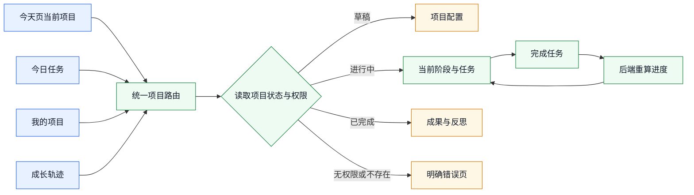
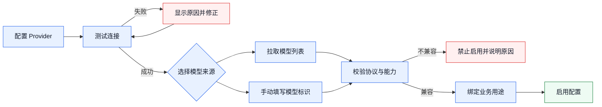
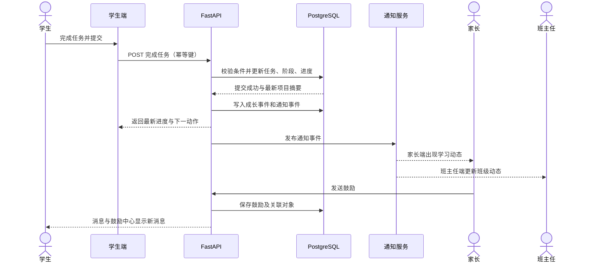

# AI 教育平台四端问题整改与功能优化开发文档 v1.0

> 文档状态：待评审  
> 编制日期：2026-09-28  
> 适用范围：学生端、家长端、班主任端、管理员端桌面 Web  
> 技术基线：前端沿用现有项目；后端采用 FastAPI；数据库采用 PostgreSQL  
> 优先级定义：P0 = 阻断核心流程，P1 = 影响主要体验，P2 = 体验完善与工程增强

## 📌 1. 文档目的与整改范围

本文档将现阶段产品走查中发现的问题转化为可设计、可开发、可联调、可验收的整改任务。整改目标不是逐页增加临时判断，而是统一项目导航、项目阶段、进度计算、筛选交互、消息反馈和权限配置等底层规则，从源头解决四端展示不一致及操作失效问题。

本期包含以下范围：

- 修复学生端项目跳转、项目阶段、任务执行及成长轨迹问题。
- 修复家长端学习进展、成长记录、作品筛选及搜索问题。
- 修复班主任端问题处理入口、统计筛选及权限边界问题。
- 修复管理员端搜索输入问题，并规范 AI Provider 与模型配置流程。
- 建立学生、家长、班主任、管理员之间的数据共享与消息传递规则。
- 建立 FastAPI 接口、PostgreSQL 数据模型、日志与验收要求。

本期不包含完整移动端重构。班主任端仅需保证桌面 Web 在较窄窗口下仍可完成核心操作，不单独设计移动端导航和交互体系。

## 🎯 2. 整改目标与产品原则

### 2.1 整改目标

| 目标 | 衡量方式 |
|---|---|
| 核心入口可达 | 所有首页、任务、项目卡片均能打开正确项目和正确阶段 |
| 项目状态一致 | 同一项目在首页、项目列表、项目详情和家长端显示同一阶段与进度 |
| 操作结果可见 | 点击继续、完成、筛选、搜索后均有明确且可验证的结果 |
| 跨端信息同步 | 学生完成任务后，家长和班主任按权限看到一致的学习事实 |
| 权限边界清晰 | 教师不配置系统级 AI 能力，所有 Provider 和模型由 Admin 管理 |
| 可测试、可回滚 | 每项整改有工单编号、验收标准、日志和发布开关 |

### 2.2 产品与工程原则

1. 单一事实来源：项目阶段、进度、任务完成状态均以后端数据为准，前端不得自行推算或维护另一套状态。
2. 单一路由规则：不同入口跳转同一项目时必须落到同一项目详情容器，仅通过参数决定默认任务和展示模式。
3. 操作幂等：重复点击“标记完成”不得重复计数、重复发消息或生成重复成长记录。
4. 即时反馈：任何按钮触发后必须出现加载、成功、失败或不可操作原因，不允许无响应。
5. 最小权限：用户只能访问角色和绑定关系允许的数据；教师端不保留系统级配置功能。
6. 桌面优先：本期按桌面 Web 交付，同时保证 1024 px 及以上宽度可正常使用。
7. 可追踪：关键跳转、阶段变更、任务完成、鼓励发送和配置变更均记录审计日志。

## 🧭 3. 统一项目导航与状态规范

### 3.1 统一项目深链

所有项目入口统一使用以下语义，不允许首页、今日任务、项目列表分别维护独立页面状态：

```text
/student/projects/{project_id}?task_id={task_id}&mode={overview|learn|practice|showcase}
```

参数约定：

| 参数 | 必填 | 说明 |
|---|---:|---|
| `project_id` | 是 | 项目唯一标识，不得使用项目名称代替 |
| `task_id` | 否 | 需要直接定位的任务；不存在时进入项目概览 |
| `mode` | 否 | 指定默认视图；未传时由当前阶段决定 |

入口映射：

| 来源 | 目标行为 |
|---|---|
| “从一个想法开始”项目按钮 | 打开对应项目详情；项目不存在时进入创建确认页 |
| “今天 > 当前项目 > 查看详情” | 打开该卡片绑定的 `project_id` |
| “今天 > 今日任务 > 开始任务” | 打开 `project_id + task_id` 对应任务 |
| “我的项目 > 项目卡片” | 进入同一项目详情容器 |
| 成长轨迹中的项目记录 | 打开产生该记录的项目或成果 |



### 3.2 统一项目阶段与生命周期

项目阶段采用唯一枚举：

```text
interest_confirmation
theory_learning
practice_build
work_refinement
showcase_reflection
completed
```

阶段中文名称分别为：兴趣确认、理论学习、实践制作、作品完善、展示反思、已完成。

项目生命周期与阶段分离：

```text
draft / active / paused / completed / archived
```

“草稿”是生命周期状态，不得因此增加或减少项目阶段。所有项目模板必须引用同一份阶段定义；确实不适用的阶段应标记为“跳过”，并由后端保留跳过原因，而不是在页面上悄然删除。

### 3.3 统一进度与按钮状态

- 总进度由后端根据已验证里程碑计算并返回 `progress_percent`。
- 首页、我的项目、详情页、家长端均读取同一字段及 `progress_version`。
- “进入”用于尚未开始的可执行阶段；“继续”用于已开始但未完成的阶段；已完成阶段显示“查看记录”。
- “标记完成”仅在任务满足完成条件时可用；不满足时说明缺失条件。
- 阶段完成后，由后端原子更新任务、阶段、项目进度和成长事件。

建议接口返回：

```json
{
  "project_id": "prj_xxx",
  "lifecycle_status": "active",
  "current_stage": "practice_build",
  "progress_percent": 46,
  "progress_version": 12,
  "next_action": {
    "type": "continue_task",
    "task_id": "task_xxx",
    "enabled": true,
    "disabled_reason": null
  }
}
```

### 3.4 列表与筛选交互

成长轨迹、作品成果、问题处理等列表统一采用局部更新：

- 点击标签或筛选条件不得整页刷新。
- 查询条件写入 URL 查询参数，以支持刷新恢复、分享和浏览器前进/后退。
- 切换筛选时保留页面布局；列表区域显示加载骨架。
- 搜索采用显式提交或 300–500 ms 防抖，不得每输入一个字符就触发页面刷新。
- 请求失败时保留用户已输入内容，并提供重试。

## 👨‍🎓 4. 学生端整改任务

### 4.1 顶部问候卡片精简

| 字段 | 内容 |
|---|---|
| 编号 | `STU-UI-001` |
| 类型 / 优先级 | 体验优化 / P1 |
| 当前现象 | 除“今天”页面外，各页面仍重复显示“你好，演示学生”大卡片，占用主要内容空间。 |
| 目标行为 | 问候卡片仅在“今天”页面展示；其他页面保留紧凑页头、页面标题和必要的用户入口。 |
| 前端小任务 | 抽离问候卡片；按路由控制显示；检查内容上移后间距和锚点；补充页面截图测试。 |
| API / 数据任务 | 无新增接口；用户信息继续由统一会话提供。 |
| 验收标准 | 访问“我的项目”“成长轨迹”等页面时不显示问候卡片；“今天”页面仍正常显示；布局无跳动。 |

### 4.2 “从一个想法开始”入口失效

| 字段 | 内容 |
|---|---|
| 编号 | `STU-NAV-001` |
| 类型 / 优先级 | 缺陷 / P0 |
| 当前现象 | “桌面 AI 机器人”“智能学习助手”“互动角色故事”三个按钮不能正确进入对应项目或功能。 |
| 目标行为 | 每个按钮均绑定明确的模板 ID 或项目 ID，并进入对应项目创建确认页或已有项目详情。 |
| 前端小任务 | 建立按钮与 ID 的配置映射；使用统一项目路由；补充缺失、无权限、模板下架状态。 |
| API / 数据任务 | 提供可用项目模板查询；返回模板状态、目标路由和是否已存在同模板项目。 |
| 验收标准 | 三个按钮逐一点击均进入正确目标；重复创建时提示进入已有项目；无 404、空白页或错误项目。 |

### 4.3 首页项目和今日任务跳转不一致

| 字段 | 内容 |
|---|---|
| 编号 | `STU-NAV-002` |
| 类型 / 优先级 | 缺陷 / P0 |
| 当前现象 | “当前项目 > 查看详情”和“今日任务 > 开始任务”进入的“我的项目”界面与直接点击“我的项目”不同，且目标项目可能不出现。 |
| 目标行为 | 所有入口携带稳定的 `project_id`；任务入口额外携带 `task_id`，并定位到同一项目详情中的目标任务。 |
| 前端小任务 | 替换名称匹配和列表索引跳转；接入统一深链；处理项目不在当前筛选结果中的情况。 |
| API / 数据任务 | 今日聚合接口必须返回 `project_id`、`task_id`、`stage` 和访问权限；不得只返回展示文本。 |
| 验收标准 | 从三个入口打开同一项目时，项目名称、阶段、进度一致；任务入口自动聚焦“光线传感器原理小测”。 |

### 4.4 “会说话的植物观察箱”状态与执行链路异常

| 字段 | 内容 |
|---|---|
| 编号 | `STU-PROJ-001` |
| 类型 / 优先级 | 核心流程缺陷 / P0 |
| 当前现象 | 实践阶段与百分比不一致；理论已完成仍显示“进入”；点击继续后仅有文件提交，缺少 AI 互动；“标记完成”无效果。 |
| 目标行为 | 阶段、进度和按钮均由后端 `next_action` 决定；实践任务包含 AI 对话、过程记录、材料提交和完成校验。 |
| 前端小任务 | 统一读取项目摘要；实现任务工作区；展示 AI 对话区、任务步骤、材料上传和完成条件；按钮添加 loading、防重复和结果反馈。 |
| API / 数据任务 | 新增任务会话、AI 消息、附件、完成校验和幂等完成接口；事务内更新进度并生成成长事件。 |
| 验收标准 | 理论完成后显示“查看记录”；实践进度与详情一致；可保存并恢复 AI 对话；条件满足后一次点击完成，刷新后状态保持。 |

建议接口：

```text
POST /api/v1/student/tasks/{task_id}/sessions
GET  /api/v1/student/tasks/{task_id}/workspace
POST /api/v1/student/tasks/{task_id}/messages
POST /api/v1/student/tasks/{task_id}/attachments
POST /api/v1/student/tasks/{task_id}/complete
```

### 4.5 “校园垃圾分类小助手”缺少继续按钮

| 字段 | 内容 |
|---|---|
| 编号 | `STU-PROJ-002` |
| 类型 / 优先级 | 核心流程缺陷 / P0 |
| 当前现象 | 理论学习项目校验完成后，页面未提供继续进入下一阶段的操作。 |
| 目标行为 | 校验成功后刷新项目状态并展示“继续实践制作”；若下一阶段未开放，明确显示原因和开放条件。 |
| 前端小任务 | 完成回调后重新获取项目摘要；渲染后端返回的 `next_action`；提供失败重试。 |
| API / 数据任务 | 校验完成接口在同一事务内推进阶段并返回下一动作；防止阶段已推进但响应丢失。 |
| 验收标准 | 校验通过后不刷新整页即可看到继续按钮；点击进入正确阶段；刷新页面后状态不回退。 |

### 4.6 草稿项目阶段定义不统一

| 字段 | 内容 |
|---|---|
| 编号 | `STU-PROJ-003` |
| 类型 / 优先级 | 数据规范 / P0 |
| 当前现象 | 草稿项目比其他页面多出“成果反思”阶段，同一产品内阶段数量和名称不一致。 |
| 目标行为 | 所有项目使用统一阶段枚举；草稿仅作为生命周期状态展示。 |
| 前端小任务 | 删除页面硬编码阶段；阶段条由 API 返回的模板阶段渲染；跳过阶段显示统一状态。 |
| API / 数据任务 | 建立项目模板阶段表并迁移存量数据；输出阶段版本；提供异常项目修复脚本。 |
| 验收标准 | 草稿、进行中、已完成项目的阶段名称来自同一字典；同一项目在各页面顺序完全一致。 |

### 4.7 成长轨迹交互优化

| 字段 | 内容 |
|---|---|
| 编号 | `STU-GROW-001` |
| 类型 / 优先级 | 功能补全 / P1 |
| 当前现象 | 连续学习卡片无法查看具体日期；完成项目、掌握目标、发布作品无法跳转。 |
| 目标行为 | 连续学习卡片打开月历并标注学习日期；三个指标进入对应的已筛选列表。 |
| 前端小任务 | 实现学习日历弹层；为指标卡增加按钮语义、键盘焦点和跳转；补充空状态。 |
| API / 数据任务 | 提供按月学习日期、连续天数及指标统计；统计值与明细共用相同查询口径。 |
| 验收标准 | 点击连续天数可查看标记日期；点击任一指标均进入匹配明细，数量与卡片一致。 |

| 字段 | 内容 |
|---|---|
| 编号 | `STU-GROW-002` |
| 类型 / 优先级 | 体验缺陷 / P1 |
| 当前现象 | 点击“全部、项目里程碑、作品成果、我的反思、掌握的项目”或选择项目时发生整页刷新。 |
| 目标行为 | 使用局部数据请求切换内容，查询参数保留筛选状态，滚动位置不被重置。 |
| 前端小任务 | 将标签改为受控状态；更新 URL 查询参数；取消原生表单提交；缓存上一次列表数据。 |
| API / 数据任务 | 成长事件接口支持 `type`、`project_id`、分页和排序参数。 |
| 验收标准 | 连续切换标签和项目无整页白屏；浏览器前进/后退可恢复筛选；请求失败仍保留筛选值。 |

### 4.8 新增“消息与鼓励”中心

| 字段 | 内容 |
|---|---|
| 编号 | `STU-MSG-001` |
| 类型 / 优先级 | 产品补全 / P1 |
| 当前现象 | 学生缺少统一位置接收班主任和家长的鼓励。 |
| 目标行为 | 新增“消息与鼓励”中心，汇总家长鼓励、班主任反馈、系统学习动态和作品评论。 |
| 前端小任务 | 增加导航入口、未读角标、消息列表、类型筛选、详情和已读状态。 |
| API / 数据任务 | 建立通知和鼓励记录；支持来源角色、业务对象、已读时间、可见范围和撤回状态。 |
| 验收标准 | 家长或教师发送后学生可在统一入口查看；未读数正确；点击消息可回到关联项目或作品。 |

安全规则：家长和教师留言作为独立业务数据保存，不得未经授权直接拼接进学生 AI 对话的系统提示词；如需供 AI 参考，必须经过明确的产品开关、内容过滤和审计。

## 👪 5. 家长端整改任务

### 5.1 “成长记录”标签错误跳转

| 字段 | 内容 |
|---|---|
| 编号 | `PAR-PROG-001` |
| 类型 / 优先级 | 缺陷 / P0 |
| 当前现象 | 在学习进展页点击“成长记录”后页面回到顶部，未像“项目进度”“作品成果”一样切换内容。 |
| 目标行为 | 三个标签采用同一标签容器，点击后局部加载对应内容并保留滚动上下文。 |
| 前端小任务 | 修正按钮类型和锚点；统一标签状态；以查询参数保存当前标签。 |
| API / 数据任务 | 校验家长对当前学生的绑定权限；成长记录接口支持分页和类型筛选。 |
| 验收标准 | 点击“成长记录”不回到顶部；内容正确切换；刷新后仍停留在该标签。 |

### 5.2 成长指标缺少明细入口

| 字段 | 内容 |
|---|---|
| 编号 | `PAR-GROW-001` |
| 类型 / 优先级 | 功能补全 / P1 |
| 当前现象 | 连续学习天数及其余三个成长指标仅展示数字，无法查看日期或明细。 |
| 目标行为 | 连续天数打开学习日历；完成项目、掌握目标、发布作品进入对应明细。 |
| 前端小任务 | 复用学生端日历和指标跳转组件；增加当前孩子上下文；完善空状态。 |
| API / 数据任务 | 使用与学生端相同的统计服务，按家长与学生绑定关系进行授权和字段脱敏。 |
| 验收标准 | 家长看到的数值与学生端一致；可查看学习日期与对应明细；切换孩子后数据同步变化。 |

### 5.3 作品成果筛选和搜索不可用

| 字段 | 内容 |
|---|---|
| 编号 | `PAR-WORK-001` |
| 类型 / 优先级 | 缺陷 / P1 |
| 当前现象 | “进行中”“已完成”按钮无反应，项目搜索不可用。 |
| 目标行为 | 状态筛选、关键词搜索和分页可组合使用；筛选结果局部更新。 |
| 前端小任务 | 接通状态参数；搜索使用提交或防抖；提供清空、无结果和加载状态。 |
| API / 数据任务 | 接口支持 `status`、`keyword`、`student_id`、分页；关键词执行安全的模糊匹配并建立必要索引。 |
| 验收标准 | 两个状态返回正确集合；输入项目名称可搜索；清空恢复全部；无整页刷新和输入丢失。 |

## 🧑‍🏫 6. 班主任端整改任务

### 6.1 桌面端窄屏可用性

| 字段 | 内容 |
|---|---|
| 编号 | `TEA-UI-001` |
| 类型 / 优先级 | 体验优化 / P2 |
| 当前现象 | 页面在较窄窗口下出现拥挤或内容不可操作，被理解为“移动端未适配”。 |
| 目标行为 | 本期不做完整移动端；保证 1024 px 及以上桌面窗口可用，关键表格允许横向滚动。 |
| 前端小任务 | 设置布局断点；压缩非必要侧栏；表格增加滚动容器；检查弹窗和按钮不溢出。 |
| API / 数据任务 | 无。 |
| 验收标准 | 在 1024×768、1280×800、1440×900 下完成核心流程；无控件重叠和不可达操作。 |

### 6.2 “待处理问题 > 查看全部”出现 404

| 字段 | 内容 |
|---|---|
| 编号 | `TEA-ISSUE-001` |
| 类型 / 优先级 | 缺陷 / P0 |
| 当前现象 | 点击“查看全部”进入不存在的页面。 |
| 目标行为 | 进入问题处理列表，并默认筛选“待介入”。 |
| 前端小任务 | 修正路由；增加路由测试；无权限时显示 403 页面而不是 404。 |
| API / 数据任务 | 问题列表支持 `status=needs_intervention`；返回当前班主任可管理范围内的数据。 |
| 验收标准 | 点击后打开正确列表；待介入数量与首页卡片一致；直接访问深链也可恢复。 |

### 6.3 问题处理统计卡无法下钻

| 字段 | 内容 |
|---|---|
| 编号 | `TEA-ISSUE-002` |
| 类型 / 优先级 | 功能补全 / P1 |
| 当前现象 | 待介入总数、处理中、已解决、家长反馈四个板块只能查看数量。 |
| 目标行为 | 点击统计卡即筛选下方问题列表；选中卡片有明显状态；可恢复“全部”。 |
| 前端小任务 | 卡片改为可访问按钮；绑定筛选状态；同步 URL；保留分页和其他筛选条件。 |
| API / 数据任务 | 统一问题状态和来源枚举；聚合统计与明细使用同一权限过滤条件。 |
| 验收标准 | 四个卡片逐一点击显示正确内容；卡片数字等于对应明细总数；不整页刷新。 |

### 6.4 移除教师端系统设置

| 字段 | 内容 |
|---|---|
| 编号 | `TEA-AUTH-001` |
| 类型 / 优先级 | 权限整改 / P1 |
| 当前现象 | 教师端存在系统级设置入口，容易造成全局配置职责不清和越权风险。 |
| 目标行为 | 教师端移除系统设置；仅保留个人资料、通知偏好等个人配置。Provider、模型、全局 AI 策略、账号和权限全部由 Admin 管理。 |
| 前端小任务 | 移除菜单、路由和页面入口；个人设置迁移至独立页面；处理旧收藏链接。 |
| API / 数据任务 | 撤销教师角色的系统配置权限；后端强制 RBAC 校验；记录越权访问日志。 |
| 验收标准 | 教师菜单无系统设置；直接访问旧地址返回 403 或引导页；Admin 功能不受影响。 |

## 🛡️ 7. 管理员端整改任务

### 7.1 学生与教师数据搜索无法连续输入

| 字段 | 内容 |
|---|---|
| 编号 | `ADM-SEARCH-001` |
| 类型 / 优先级 | 缺陷 / P0 |
| 当前现象 | 搜索框每输入一个字符即刷新页面，输入焦点和内容丢失，无法正常检索。 |
| 目标行为 | 输入过程不刷新页面；按 Enter、点击搜索或防抖结束后更新列表。 |
| 前端小任务 | 使用受控输入；阻止表单默认提交；实现 300–500 ms 防抖或显式搜索；取消过期请求。 |
| API / 数据任务 | 搜索接口支持关键词和分页；对姓名、账号、班级等字段建立合适索引；限制最大关键词长度。 |
| 验收标准 | 可连续输入中文、英文和数字；输入法组合态不触发查询；结果正确；慢请求不会覆盖新结果。 |

### 7.2 Provider 与模型配置规范

| 字段 | 内容 |
|---|---|
| 编号 | `ADM-AI-001` |
| 类型 / 优先级 | 产品与权限补全 / P1 |
| 当前现象 | Provider、模型和业务用途之间缺少明确前置关系，可能选择未配置或不可用模型。 |
| 目标行为 | 必须先配置并验证 Provider，才能选择其模型；同时允许管理员手动填写 Provider 支持的模型标识。 |
| 前端小任务 | 建立分步配置；未验证 Provider 时禁用模型选择；支持拉取模型列表和手动填写；显示连接与兼容性状态。 |
| API / 数据任务 | 提供 Provider 加密存储、连接测试、模型发现、模型校验、业务绑定和启停接口；保存配置版本及审计记录。 |
| 验收标准 | 未配置 Provider 时无法启用模型；连接测试失败时给出可操作错误；手填模型通过协议校验后可保存；停用 Provider 后关联业务自动不可选。 |

推荐流程：



Provider 最少包含：名称、协议类型、Base URL、密钥密文、组织或项目标识、超时、重试策略、连接状态、最近测试时间。模型最少包含：模型标识、显示名称、能力类型、上下文长度、是否支持流式输出、所属 Provider、启用状态和业务用途。

## 🔄 8. 跨端数据共享与信息闭环

### 8.1 数据共享边界

| 数据 | 学生端 | 家长端 | 班主任端 | 管理员端 |
|---|---|---|---|---|
| 项目阶段与进度 | 查看本人、执行任务 | 查看已绑定孩子摘要 | 查看所管学生及班级聚合 | 查看全局与异常数据 |
| 任务过程 | 查看和编辑本人 | 默认只看摘要，不看私密 AI 对话 | 按教学需要查看摘要和提交物 | 仅审计或授权排障 |
| 作品成果 | 创建、提交、发布 | 查看与鼓励 | 评价、反馈和推荐 | 管理规则与违规内容 |
| 成长记录 | 查看本人 | 查看已绑定孩子 | 查看所管学生 | 管理指标口径 |
| 鼓励与反馈 | 接收和查看 | 发送家长鼓励 | 发送教学反馈、处理问题 | 管理模板、权限和审计 |
| AI 配置 | 不可见 | 不可见 | 不可见系统配置 | 配置 Provider、模型和策略 |

### 8.2 学生行为到家长、教师的信息同步



### 8.3 统一反馈渠道

建议建立三级反馈闭环：

1. 轻量鼓励：家长或教师对项目、里程碑、作品发送短文本或预设鼓励语，进入学生“消息与鼓励”中心。
2. 教学反馈：班主任对任务或作品给出结构化建议，学生可查看并标记已处理。
3. 问题反馈：家长或教师提交需介入的问题，进入班主任问题处理队列；必要时升级给管理员。

每条反馈必须包含发送者、接收者、学生、关联业务对象、类型、内容、状态、创建时间、读取时间和处理记录。删除或撤回应保留审计记录。

### 8.4 学生、家长与班主任绑定方案

采用“学校关系由后台建立，家庭关系支持自助申请并可后台审核”的混合模式：

- 班主任与学生：由 Admin 导入学年、班级、班主任和学生名单，或由有权限的教务人员调整；教师不能自行搜索并绑定任意学生。
- 学生账号：由学校预创建或通过学校发放的注册码激活，账号始终关联唯一学生档案。
- 家长与学生：家长注册后，通过学生端生成的一次性绑定码、学校发放的家庭邀请码，或后台人工绑定建立关系。
- 自助绑定：必须同时校验绑定码、学生辅助信息和家长手机号；绑定码短期有效、单次使用且不可被日志明文记录。
- 异常审核：信息不匹配、绑定码失效、解除主要监护人等情况进入班主任或 Admin 审核队列。
- 多重关系：一个学生可绑定多位监护人，一个家长也可绑定多个孩子；每条关系记录称谓、是否主要监护人、可见权限和有效期。
- 解绑规则：普通家长可申请解绑本人关系；涉及最后一位主要监护人时必须经后台审核，历史操作记录不得删除。

绑定状态统一为：

```text
pending / active / rejected / revoked / expired
```

关键接口建议：

```text
POST /api/v1/student/binding-codes
POST /api/v1/guardian/bindings
GET  /api/v1/guardian/bindings
POST /api/v1/staff/bindings/{binding_id}/approve
POST /api/v1/bindings/{binding_id}/revoke
```

验收时必须覆盖绑定码重复使用、错误信息尝试次数限制、多个孩子切换、教师调班、学年结束关系归档和越权读取等场景。

## 🧱 9. FastAPI 与 PostgreSQL 实现要求

### 9.1 服务模块建议

```text
app/
├── api/v1/
│   ├── projects.py
│   ├── tasks.py
│   ├── growth.py
│   ├── works.py
│   ├── issues.py
│   ├── messages.py
│   └── admin_ai.py
├── models/
├── schemas/
├── services/
├── repositories/
├── core/
└── tests/
```

建议采用 SQLAlchemy 2.x、Alembic、Pydantic v2 和 asyncpg。若现有前端已调用 `/api/v1/...`，迁移时保持路径与响应语义兼容，避免同时大规模改动前后端。

### 9.2 核心数据表

| 表 | 关键用途 |
|---|---|
| `users`、`roles`、`user_roles` | 用户与角色权限 |
| `student_guardian_bindings` | 学生与家长绑定及状态 |
| `teacher_class_bindings` | 班主任与班级、学生的管理关系 |
| `project_templates`、`template_stages` | 项目模板和统一阶段定义 |
| `student_projects`、`project_stage_records` | 学生项目、生命周期和阶段记录 |
| `tasks`、`task_attempts`、`task_sessions` | 任务、尝试记录和 AI 实践会话 |
| `works`、`work_assets` | 作品及附件 |
| `growth_events`、`learning_days` | 成长轨迹和学习日期 |
| `messages`、`encouragements` | 通知、反馈与鼓励 |
| `issues`、`issue_events` | 问题处理及状态流转 |
| `ai_providers`、`ai_models`、`ai_bindings` | Provider、模型和业务用途 |
| `audit_logs` | 配置、权限和关键业务操作审计 |

### 9.3 核心 API 清单

| 方法与路径 | 用途 | 关联任务 |
|---|---|---|
| `GET /api/v1/student/today` | 今日聚合，返回稳定项目和任务 ID | `STU-NAV-002` |
| `GET /api/v1/projects/{project_id}` | 项目统一摘要和下一动作 | `STU-PROJ-001` |
| `POST /api/v1/tasks/{task_id}/complete` | 幂等完成任务并推进状态 | `STU-PROJ-001`、`STU-PROJ-002` |
| `GET /api/v1/growth/events` | 成长轨迹筛选与分页 | `STU-GROW-002` |
| `GET /api/v1/growth/calendar` | 月度学习日期 | `STU-GROW-001`、`PAR-GROW-001` |
| `GET /api/v1/works` | 作品状态筛选与搜索 | `PAR-WORK-001` |
| `GET /api/v1/issues` | 问题列表筛选 | `TEA-ISSUE-001`、`TEA-ISSUE-002` |
| `POST /api/v1/encouragements` | 家长或教师发送鼓励 | `STU-MSG-001` |
| `GET /api/v1/messages` | 学生消息中心 | `STU-MSG-001` |
| `POST /api/v1/admin/providers/{id}/test` | 测试 Provider 连接 | `ADM-AI-001` |
| `GET /api/v1/admin/providers/{id}/models` | 拉取模型列表 | `ADM-AI-001` |
| `POST /api/v1/admin/models/validate` | 校验手填模型与能力 | `ADM-AI-001` |

### 9.4 一致性、安全与可观测性

- 使用数据库事务完成“任务完成 → 阶段推进 → 进度重算 → 成长事件”操作。
- 完成接口接收 `Idempotency-Key`，数据库建立唯一约束防止重复写入。
- 所有面向学生数据的查询先校验本人、家长绑定或教师班级权限。
- Provider 密钥只以密文保存，API 响应永不返回完整密钥。
- 日志不得记录学生私密对话全文、密码、Token 或 Provider 密钥。
- 为跳转失败、任务完成失败、筛选请求、搜索耗时和模型连接测试建立指标。

## 🧩 10. 小任务拆分与实施顺序

### 10.1 P0：先恢复核心可用性

| 小任务 | 内容 | 依赖 | 建议角色 |
|---|---|---|---|
| `P0-01` | 定义统一项目路由、阶段枚举、生命周期和 `next_action` Schema | 无 | 产品 + 前后端 |
| `P0-02` | 今日聚合接口补齐 `project_id`、`task_id` | `P0-01` | 后端 |
| `P0-03` | 首页、今日任务、我的项目接入统一深链 | `P0-02` | 学生端前端 |
| `P0-04` | 后端统一计算进度并迁移存量阶段数据 | `P0-01` | 后端 + DBA |
| `P0-05` | 修复任务继续、阶段推进和幂等完成 | `P0-04` | 前后端 |
| `P0-06` | 修复班主任“查看全部”404 | 无 | 班主任端前端 |
| `P0-07` | 修复家长端“成长记录”标签 | 无 | 家长端前端 |
| `P0-08` | 修复管理员搜索输入和请求竞态 | 无 | 管理端前端 + 后端 |
| `P0-09` | 增加核心流程回归和数据一致性测试 | `P0-03` 至 `P0-08` | 测试 |

### 10.2 P1：补齐主要体验与跨端闭环

| 小任务 | 内容 | 依赖 | 建议角色 |
|---|---|---|---|
| `P1-01` | 建设学生 AI 实践任务工作区 | `P0-05` | 学生端前端 + AI 后端 |
| `P1-02` | 成长轨迹改为 SPA 标签、项目筛选和 URL 状态 | 成长事件接口 | 学生端前端 |
| `P1-03` | 开发学生与家长复用的学习日历 | 学习日期接口 | 前后端 |
| `P1-04` | 接通家长作品状态筛选和搜索 | 作品查询接口 | 家长端前端 |
| `P1-05` | 班主任问题统计卡下钻筛选 | 问题查询接口 | 班主任端前端 |
| `P1-06` | 建设消息与鼓励中心及跨端通知 | 权限与绑定关系 | 四端 + 后端 |
| `P1-07` | 移除教师系统设置并收紧 RBAC | Admin 配置可用 | 前后端 |
| `P1-08` | 实现 Provider → 模型 → 业务用途配置流程 | RBAC + 密钥管理 | 管理端 + 后端 |
| `P1-09` | 完成跨端联调、权限和通知测试 | `P1-01` 至 `P1-08` | 测试 |

### 10.3 P2：体验和工程质量完善

| 小任务 | 内容 | 依赖 | 建议角色 |
|---|---|---|---|
| `P2-01` | 班主任端 1024 px 以上窄屏适配 | 主要页面稳定 | 前端 |
| `P2-02` | 完善深链错误页、空状态和断网恢复 | 统一路由 | 前端 |
| `P2-03` | 增加操作审计、性能指标和业务埋点 | 核心 API 稳定 | 后端 + 运维 |
| `P2-04` | 建立视觉回归、可访问性和跨浏览器测试 | 页面稳定 | 测试 |

## ✅ 11. 测试与验收方案

### 11.1 核心验收场景

| 场景 | Given | When | Then |
|---|---|---|---|
| 项目入口一致 | 学生已有目标项目 | 分别从今天页、今日任务和我的项目进入 | 打开同一项目，阶段和进度一致 |
| 任务完成 | 实践任务已满足条件 | 点击“标记完成”两次 | 仅完成一次，进度正确，生成一条成长事件 |
| 阶段推进 | 理论校验成功 | 返回项目页 | 显示下一阶段“继续”按钮 |
| 成长筛选 | 成长轨迹包含多种事件 | 切换标签和项目 | 局部更新、URL 同步、无整页刷新 |
| 家长成长记录 | 家长已绑定学生 | 点击“成长记录” | 原位置切换内容，不回到顶部 |
| 作品搜索 | 存在进行中和已完成作品 | 组合状态与关键词搜索 | 返回准确结果，输入内容不丢失 |
| 教师问题列表 | 存在待介入问题 | 点击“查看全部”或统计卡 | 进入正确筛选列表，无 404 |
| Admin 搜索 | 列表存在学生或教师 | 连续输入中文关键词 | 输入不中断，结果按最后关键词返回 |
| 模型配置 | Provider 尚未验证 | 尝试启用模型 | 系统禁止启用并提示先测试连接 |
| 鼓励闭环 | 家长已绑定学生 | 家长发送项目鼓励 | 学生消息中心出现一条可回溯消息 |

### 11.2 测试层级

- 单元测试：阶段转换、进度计算、权限判断、搜索防抖、状态映射。
- API 测试：成功、无权限、资源不存在、重复提交、并发提交和分页边界。
- 集成测试：任务完成事务、成长事件生成、消息通知、Provider 测试与模型校验。
- 端到端测试：四端核心入口、项目完整流程、反馈闭环和 Admin 配置流程。
- 视觉测试：主要桌面分辨率、长文本、空状态、加载态、错误态和弹窗。
- 安全测试：越权访问、ID 枚举、敏感字段泄漏、上传文件校验和密钥脱敏。

### 11.3 数据一致性检查

发布前后执行以下核对：

1. 首页、学生项目列表、项目详情和家长端同一项目的阶段与进度一致。
2. 已完成任务数、成长事件数和进度里程碑不存在重复记录。
3. 所有存量草稿项目均能映射至统一阶段模板。
4. 家长只能查看有效绑定学生，教师只能查看所管班级学生。
5. 聚合统计数与点击下钻后的明细总数一致。

## 🚀 12. 发布、灰度与回滚

### 12.1 推荐发布顺序

1. 先发布数据库迁移和兼容版 FastAPI，保留旧字段读取能力。
2. 发布统一项目 Schema、进度计算与任务完成接口。
3. 灰度学生端项目导航和任务流程。
4. 发布家长端、班主任端筛选与成长功能。
5. 发布消息与鼓励中心。
6. 最后迁移教师系统设置并启用 Admin 模型配置。

### 12.2 灰度指标

- 项目深链成功率。
- 任务完成接口成功率和重复提交率。
- 项目阶段与进度不一致数量。
- 404、403 和前端运行时错误率。
- 列表搜索、筛选请求成功率和 P95 响应时间。
- Provider 测试成功率与模型校验失败原因分布。

### 12.3 回滚要求

- 数据库迁移必须提供向前修复方案；涉及阶段映射的数据迁移先备份再执行。
- 新项目状态接口通过功能开关灰度；异常时可切回兼容读取层。
- 前端保留上一稳定构建产物，回滚不得删除已产生的任务和成长数据。
- Admin 配置变更保留版本号，可回退到上一有效配置，但不得恢复已泄露或被吊销的密钥。

## 📋 13. 完成定义

单项任务只有同时满足以下条件才可标记完成：

- 产品目标、状态规则和权限边界已评审。
- 前端、FastAPI、PostgreSQL 迁移及必要的兼容逻辑均已完成。
- 正常、空、加载、失败、无权限和重复操作状态均有明确表现。
- 单元测试、API 测试和关联端到端测试通过。
- 在 1024×768、1280×800、1440×900 桌面视口验收通过。
- 关键操作有日志和指标，敏感信息已脱敏。
- 文档、接口契约、数据库迁移说明和回滚步骤已更新。
- 测试人员依据本文档验收标准确认通过，且无未处理的 P0 缺陷。

## 📝 14. 评审待确认事项

以下事项应在进入 P1 开发前由产品、技术和业务共同确认：

1. “从一个想法开始”是直接创建项目、进入模板详情，还是优先进入已有同类项目。
2. 不同项目是否允许跳过阶段；如允许，跳过权限和原因由谁配置。
3. AI 实践任务的完成条件由规则自动判断、教师确认，还是两者结合。
4. 家长可见的 AI 对话范围，以及学生隐私与安全策略。
5. 鼓励是否允许自由文本、预设模板、表情或附件，以及内容审核方式。
6. 教师系统设置移除后的个人偏好清单和旧配置迁移方式。
7. Provider 支持的协议范围、模型能力标签和各业务场景的默认模型策略。
8. 班主任端是否在后续版本单独立项进行完整移动端适配。

上述待确认事项不阻塞 P0 缺陷修复；未确认部分应通过功能开关与兼容数据结构预留，不得在页面内硬编码临时规则。
