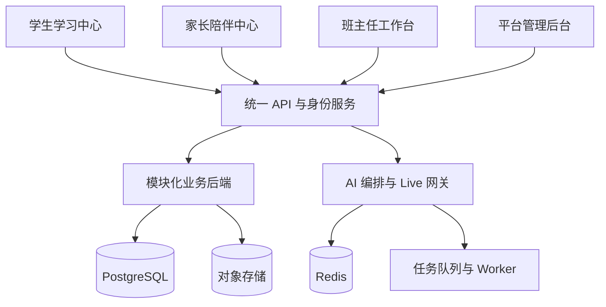

# 启途智学架构

> 本文是工程架构的入口页，描述模块边界、表归属、依赖规则与迁移顺序。
> 细化内容见：`docs/DATABASE.md`、`docs/PERMISSIONS.md`、`docs/INITIALIZATION.md`、
> `docs/PLATFORM_CONTROL_PLANE.md`、`docs/LLM_MODEL_REGISTRY.md`、`docs/decisions/`。
> 产品开发基线：`docs/AI教育平台前后端开发文档_v1.0.md`。
> **出现冲突时，先更新文档和 Issue，再修改实现。**

## 0. 一句话

四个平台是四个独立前端应用，共享一套认证、API、数据模型和 AI 服务。
首期采用**模块化单体后端 + 异步任务**，不提前拆分大量微服务（ADR 0001）。

```text
apps/* → API / identity → domain modules → PostgreSQL
                         ├→ object storage
                         ├→ Redis
                         └→ queue / workers → AI and notifications
```



## 1. 代码边界

- `apps/`：平台应用，只组合 features，不互相导入业务代码。
- `packages/contracts/`：跨端 API 和领域类型。
- `packages/permissions/`：纯策略 seam；数据库支撑的对象级授权属于 API `access` 层。
- `packages/database/`：Drizzle schema + client（**代码包**，导出运行时值，需 build 到 `dist/`）。
- `packages/ui` / `design-tokens` / `auth` / `api-client` / `realtime` / `ai-client` / `file-uploader` / `validation` / `analytics`：共享能力。
- `packages/ai-client`：Tutor Agent SDK 的纯合同和端口；Agent 只能通过知识库、模板库、数据库投影端口读取，不能获得数据库句柄。
- `services/api/`：模块化单体 API；Admin 是知识库、模板库、模型和运行时治理的控制面。
- `services/workers/`：转写、摘要、成长计算、画像投影和索引等异步 Agent 任务。
- `services/realtime-gateway/`：Live 语音与流式网关（规划）。
- `database/`：**产物目录**——迁移、种子、fixture（见 `docs/DATABASE.md` 分工）。

## 2. 领域模块与边界

| 领域模块 | 职责 | 单一写入对象 |
|---|---|---|
| Identity & Access | 用户、角色、会话、家庭、监护关系、班主任分配、对象级访问策略 | `users`、`households`、`guardian_links`、`mentor_assignments` |
| Tenancy | 校域根表与 `school_id` 归属（`NULL` = 平台共享） | `schools` |
| Directory | 身份与关系的**单一真源**，双引擎（Postgres / 内存） | 只读汇总，写经 Identity & Access |
| Projects & Learning | 模板版本、项目实例、阶段、任务、学习计划/模块/目标/课次、掌握度事件与当前投影、成长时间线门槛 | `project_templates*`、`projects*`、`learning_plans*`、`pending_questions`、`mastery_events`、`mastery_records`、`mastery_*`、`theory_*`、`practice_*` |
| Works | 作品与版本历程、项目证据（服务端聚合，只读） | `artifacts`、`artifact_versions`、`project_evidence` |
| AI Tutor | 会话、turn、context packet、提示等级、模型路由、卡顿检测 | `tutor_*`、`context_snapshots` |
| Model Registry | Provider → Model → Usage 三层模型接入 | `model_providers`、`model_models`、`model_usage_bindings`（规划） |
| Mentor Operations | 班级日常问题、干预、教师评审读取；不直接治理平台知识库/模板库/数据库 | `alerts`、`interventions`、`mentor_reviews` |
| Parent Experience | 家长成长快照、消息与反馈（授权投影） | 只读投影 + `notifications` |
| Growth | 成长记录、学生长期记忆与里程碑 | `growth_records`、`student_memories`、`growth_snapshots`、`milestones` |
| Admin & Compliance | 平台配置、AI 策略版本、审计、数据保留、敏感访问审批、模板验证报告 | `audit_logs`、`outbox`、`template_verification_runs`、`template_verification_evidence`、`ai_*` |
| Platform Registry | AI 运行时**只读投影**：skills / MCP 服务器 / agents / 内置工具 / 初始化状态；不新增运行时注册表 | 无写入对象（只读投影） |
| Initialization | 受限 foundation 初始化命令（`knowledge` / `template` / `tutor`），幂等 + 审计同事务；`database` area 恒拒绝 | 经 owner 表写 foundation 行（`knowledge_*`、`project_templates*`、`agent_memory_records`、`outbox`） |

> **规则**：`projects` 是项目状态机的唯一写入者；`access`（目录）是对象级授权唯一入口；
> `audit` 记录敏感读取与管理变更；`outbox` 保证事务与事件一致。
> 跨模块写只能走命令 / 事件 / outbox，不得直接写别的模块的表（ADR 0002 / 0006）。

### 2.1 管理员与班主任的职责边界

平台治理与班级日常是两类工作；边界见 `docs/decisions/0008-admin-teacher-boundary.md`。

- **班级日常 = 班主任**：个别学生的日常处理（学生管理、问题处理、人工干预、项目复核、
  班主任笔记）归班主任，权限来自 `mentor_assignments(status=active, mentor_user_id=自己)`。
- **平台治理 = 管理员**：账户、家庭与关系、知识库与模板版本、AI 策略与模型路由、审计与数据保留。
- **教师端 = 班级日常**：学生管理、问题处理、人工干预、项目复核和统计；不提供知识库、模板库或数据库管理入口。基础库的读取由服务端按授权投影提供。
- **管理员默认只进入聚合 / 治理视图**，不得把个别学生的日常处理流设为默认落地页。
- 管理员查看个别学生数据（含 `/admin/students/:id`）必须：对象级授权范围、最小字段可见性、
  目的 / 原因、敏感场景二次确认、写审计、限时有效。
- 四个平台都把**账号与安全**（凭证、MFA、设备会话、退出）放在**跨角色账户面**
  （顶栏账户入口），它不是任何平台的业务导航项；平台 / AI 设置归管理后台。
- **前端隐藏不构成授权**：入口是否渲染只是体验，后端必须对每个请求重新做对象级校验
  （见 `docs/PERMISSIONS.md`）。

表归属与迁移顺序的完整清单见 `docs/DATABASE.md`。

## 3. 依赖规则

```text
apps → packages/contracts + packages/api-client + packages/ui
apps ✕ apps/* 业务代码
api modules → domain / application / infrastructure / presentation
api modules ✕ 直接写其他模块的数据库表
cross-domain writes → command / event / outbox
parent reads → authorized projection only
```

1. 四个前端只依赖 `packages` 和 API 合同，不互相导入业务代码。
2. 页面只负责组合模块，业务逻辑放入 `features` / `hooks` / `services`。
3. 前端权限只控制显示，后端必须执行对象级权限校验（`docs/PERMISSIONS.md`）；
   **隐藏入口不是授权**：后端不得因为「前端没渲染按钮」而放行。
4. 核心业务规则只能由后端领域模块修改。
5. AI、语音、项目状态转换不能由客户端直接写数据库。
6. **workspace 包只要导出运行时值，就必须 build 到 `dist/` 并把 `exports` 指向产物**；
   纯类型包才可指向 `src/index.ts`（ADR 0003 实施补充 1）。

## 4. 数据与迁移

- PostgreSQL 是业务事实、掌握度事件和当前门槛投影的 system of record；缓存 Redis；文件走私有对象存储 + 签名 URL；向量检索 pgvector。Graphiti 如接入，只作为由 outbox 驱动的掌握度时间线投影，不能决定 `TheoryMastered`、实践解锁、项目状态或权限。
- 迁移前向、可对空库重放；`packages/database/src/schema/**` 是单一写入者资产。
- 迁移顺序：基础设施/身份 → 项目与学习 → AI/成长 → 运营与模型 → 单一学校领域基础层（0008）→ 验证/作品/待答题（0009，纯增量）（详见 `docs/DATABASE.md`）。
- **校域范围**：`school_id` 可空列（`NULL` = 平台共享）；共享/私有边界与"领域真源 vs AI 工作区适配层"见 `docs/DATABASE.md` §3.1 / §3.2。
- 初始化分 `demo`（迁移 + 种子）与 `live`（仅迁移）两档，绝不隐式混用（`docs/INITIALIZATION.md`）。

## 5. AI 与模型接入

- Agent 需要模型：`tutor.chat`、`tutor.live`、`inspiration.recommend`、`curriculum.plan`、
  `growth.summarize`、`profile.summarize`、`knowledge.embed`。
- 三层：Provider（网关 + 协议 + 凭证）→ Model（能力 + 显示名）→ Usage（绑定）。
- Agent SDK 不暴露数据库连接；由 API 提供知识、模板、项目、掌握度、成长和画像的有界读取端口。
- 生成链路：Agent 读取授权投影 → 输出带 `sourceRefs` 的结构化结果 → 领域服务校验/幂等落库 → Worker 生成各端投影。
- 显式支持三种协议：OpenAI Compatible / Chat Completions、OpenAI Responses、Anthropic Messages。
- 详见 `docs/LLM_MODEL_REGISTRY.md` 与 ADR 0007。

### 5.3 Agent SDK 与前后端协同

`packages/contracts/src/agent-runtime.ts` 定义 Agent 运行上下文、能力、知识/模板/数据库读取端口和输出投影。它不是数据库 ORM，也不是让前端直接调用模型的 SDK。

- `TutorAgentContext`：绑定学生、Partner、项目、会话、能力和证据引用。
- `TutorAgentOutput`：必须带 Agent 版本、输出类型、生成时间和来源引用。
- `TutorGrowthProjection` / `TutorLearnerProfileProjection`：分别面向成长轨迹和个人画像的安全显示模型；家长/教师字段不能进入学生投影。
- 项目状态、掌握度、成长事实、画像版本、审计和记忆写入仍由服务端领域模块执行，Agent 只能提出结果。
- 知识库、模板库和数据库初始化/治理由 Admin 控制面负责；Tutor/Worker 通过只读端口使用已发布版本。

推荐链路：

```text
Admin 发布知识 / 模板 / Agent / Skill / 模型版本
  -> Agent Runtime resolver
  -> ContextBuilder 组装授权投影
  -> capability agent（explore / plan / teach / review / reflect）
  -> structured output + sourceRefs
  -> domain validation + idempotent command
  -> outbox / Worker
  -> growth/profile/student/parent/teacher projections
```

### 5.4 SDK 底座分层（2026-10-04）

SDK 采用三层分工，禁止把它们作为同一个万能 SDK 使用：

- `TutorAgentRuntime`（`@qitu/ai-client/agent-runtime`）是 Agent 编排底座。它绑定 API 已授权的 `TutorAgentScope`，只暴露绑定后的知识、模板和数据库 projection 读取端口，校验 runtime/agent/request 版本和结构化输出，并要求每次 run 携带幂等键。
- `TutorContextReader` / `TutorDomainWriter` 是 Tutor 适配层。前者只组装有界 context packet，后者只调用领域 owner 暴露的成长和记忆命令。
- `QituSDKFactory` / `QituSDK` 是服务端领域 facade，只负责 scope-bound mastery、项目推进和 profile 访问；项目状态、掌握度和审计仍由对应领域服务决定。

Agent runtime 的读取 facade 不接受调用者传入 `studentId`、`projectId` 或数据库句柄，防止模型适配层通过参数替换越权。Agent 输出必须带 `runId`、`requestId`、版本、来源引用和工具调用记录；它不能直接提交项目状态、掌握度、成长事实、画像、记忆或审计写操作。

工具 registry 只保存 server-owned 描述和 capability 白名单。Admin 可以查看脱敏元数据，但工具实际执行仍由 Tutor、Projects、Mastery、Growth 或 Worker owner 负责。后续 resolver、真实 executor、projection worker 和持久化 capability registry 按独立 Issue 接入，不在合同底座中预先模拟。
## 5.1 掌握度时间线边界

掌握度时间线是 Projects & Learning 的一等领域能力，详细协议见
[`decisions/0009-mastery-timeline-and-graphiti.md`](./decisions/0009-mastery-timeline-and-graphiti.md)。

- `mastery_events` 是不可变评估事件，必须带有效时间、记录时间、算法版本、幂等键和证据引用。
- `mastery_records` 是当前掌握度投影，`TheoryMastered` 和项目门槛只读取该投影。
- `KnowledgePoint` 使用跨项目稳定 ID；学习计划 `objectiveId` 只表示计划内教学目标。
- Graphiti 只由 Worker 异步写入，作为可重建时间线查询投影；Graphiti 不可用时核心学习流程继续运行。
- 成长轨迹、家长端和教师端读取授权后的时间线/快照投影，不直接读取 Graphiti。
- Mem0 只保存非掌握类长期偏好，禁止写入掌握 level 或项目阶段。

### 5.2 当前落地状态（诚实标注）

**已存在**：`mastery_records`、`mastery_attempts`、掌握度纯函数和服务端
`TheoryMastered` 判定。

**已实现但尚未提交**：`mastery_events`、显式 objective→KnowledgePoint mapping、0011
迁移、assessment transaction、统一 `QituSDKFactory/createQituSDK`、只读 API/SDK、项目
can-advance/advance 和 Graphiti projection scaffold。历史 current/threshold、timeline/snapshot
从事件账本派生；不同 courseVersion 分组隔离，unknown/revoked 不填零。

**待实施/验收**：课程治理/映射回填、快照物化、完整 correction/revoke 写命令、前端曲线、
真实 Graphiti/Neo4j round-trip、备份恢复、性能和成本验收。

## 6. 当前落地状态（诚实标注）

**已实现（Stage 1，主工作树未提交）**

- `packages/database` Drizzle schema + client + 幂等种子；迁移 `0000`–`0013` 存在于
  `database/migrations/`（`0010_agent_memory`、`0011_mastery_timeline`、`0012_mastery_graph_receipts`、
  `0013_tutor_exploration_context`）。
  **注意**：Drizzle `database/migrations/meta/_journal.json` / `meta/*_snapshot.json` 仍停在 `0009`，
  且 `0013` 尚未提交（untracked），因此当前只能按文件名顺序用裸 `psql` 重放（见 `docs/INITIALIZATION.md` §3）。
- 迁移 `0008_domain_foundation`：`schools`、共享/校域项目模板与冻结版本、作用域知识文档/分块、学习计划/模块/目标/课次、掌握度记录/尝试、成长记录、学生记忆、班主任评审；并回填 `users.school_id` 与项目/探索会话的 `template_version_id` 外键。
- 迁移 `0009_verification_evidence`（纯增量）：`template_verification_runs` / `template_verification_evidence`（不可变模板验证报告与证据）、`artifacts` / `artifact_versions`（作品与版本历程）、`project_evidence`（服务端聚合只读的项目证据）、`pending_questions`（跨轮持久待答题，答案服务端私有）。表结构 + 外键 + 幂等/部分唯一索引已就位，API 接线见 `docs/DATABASE.md` §3.3。
- `DirectoryService` 双引擎；`DatabaseModule` 可选接入（无 URL 时 inert）。
- 身份/关系管理、班主任端、家长端只读投影。
- 模型注册表三层与自动拉取（仅内存）。
- 管理后台 AI 运行时只读投影与受限幂等初始化：
  `GET /api/v1/admin/ai-runtime`、`GET /api/v1/admin/initialization`、
  `POST /api/v1/admin/initialization/{knowledge|template|tutor}/execute`；
  `agents` 只读取 Tutor Partner/服务端 Agent Registry，`skills` 读取 `.agents/skills`，
  MCP 在安全 Registry 接入前为空，内置工具来自服务端脱敏注册表（详见 `docs/PLATFORM_CONTROL_PLANE.md`）。

**未实现（不在本文当作已完成）**

- 0008/0009 领域表的 service 读写接入（当前仅表结构与种子）；项目/任务/理论/实践其余表与模块。
- 模板验证落库接线：`services/api/src/modules/templates` 目前是确定性纯函数 + 只读证据聚合，尚未写 `template_verification_runs`；作品发布、项目证据物化、待答题持久化同样待接线。
- AI 会话持久化；成长档案与 AI 总结接入。
- 审计写入与查询；会话持久化与 MFA；pgvector 与知识库（`knowledge_chunks.embedding` 暂用 JSONB 占位）。
- 校域行级隔离（RLS / 跨校强制校验）；`school_id` 目前仅供应用层过滤。
- 可执行的运行时 skill / MCP 配置写入口与 MCP 健康探测尚未实现；当前已有安全的只读元数据发现和内置工具注册表。
- 迁移版本探测（`initialization.migrationVersion` 恒为 `null`）。
- 模型注册表落库、连接测试、手工模型、显示名编辑；密钥管理服务。
- `mastery_records` 当前投影、`mastery_events` append-only 事件和显式 objective→KnowledgePoint mapping（**已实现 schema + 0011 migration + store 窄接口 + answer/evidence assessment transaction + audit/outbox 同事务**）。
- `mastery_graph_receipts`、`services/workers/src/mastery-projection-worker.ts` 和 `services/graphiti/bridge.py` 已提供 projection scaffold；外部 Graphiti 未配置时核心流程继续使用 PostgreSQL。
- 后续需继续验证：映射回填覆盖、真实 PostgreSQL 并发回滚、纠错/撤销写命令和完整 FSRS 字段接线。


## 7. 待办（跨模块）

- [ ] 掌握度时间线接线：`mastery_events`、canonical KnowledgePoint、历史快照、`MasteryTimelinePort` 和 Graphiti shadow projection（见 ADR 0009）。
- [x] 掌握度事件/mapping schema、0011 migration 和 learning-plan store 窄接口。
- [x] 答题/实践证据的 event + projection + audit/outbox 同事务；重复请求和事务失败回滚有测试。
- [x] mastery 只读查询的课程版本隔离、历史时刻、游标、未知/撤销和查询白名单；标准测试命令包含新用例。
- [ ] 模板库 / 知识库 / 成长轨迹接入时的表归属与命令边界（0008/0009 已建表，service 读写与投影接入待完成）。
- [ ] 0009 表接线：验证报告落库（模板治理）、作品发布与版本、项目证据物化、待答题持久化与 `answer_pending` 状态机。
- [ ] `tutor_*` 适配层与 0008 领域真源的合并/下线顺序。
- [ ] 校域行级安全（RLS）与多校租户切换策略。
- [ ] 项目状态机与「理论未掌握不得进入实践」的强校验。
- [ ] 审计、幂等、outbox 从占位变为普遍能力。
- [ ] `support` 角色与敏感访问审批。
- [x] 管理后台 AI 运行时只读投影（`platform-registry`）与受限幂等初始化端点（`initialization`）。
- [ ] 生产运行时 skill / MCP server / 内置工具注册表与配置写入口；运行时健康探测接入 `overall`。
- [ ] 管理员个别学生访问的范围 / 原因 / 二次确认 / 限时授权模型（ADR 0008）。
- [ ] 跨角色账户面（凭证、MFA、设备会话、退出）尚未实现。

> Issue 登记册与执行顺序见 `docs/ISSUES.md`。
