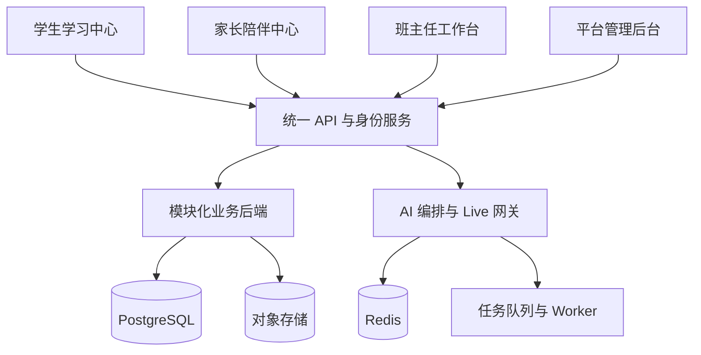

# 启途智学架构

> 本文是工程架构的入口页，描述模块边界、表归属、依赖规则与迁移顺序。
> 细化内容见：`docs/DATABASE.md`、`docs/PERMISSIONS.md`、`docs/INITIALIZATION.md`、
> `docs/LLM_MODEL_REGISTRY.md`、`docs/decisions/`。
> 产品开发基线：`docs/AI教育平台前后端开发文档_v1.0.md`。
> **出现冲突时，先更新文档和 Issue，再修改实现。**

## 0. 一句话

四个平台是四个独立前端应用，共享一套认证、API、数据模型和 AI 服务。
首期采用**模块化单体后端 + 异步任务**，不提前拆分大量微服务（ADR 0001）。

```text
apps/* → API / identity → domain modules → PostgreSQL
                         ├→ object storage
                         ├→ Redis
                         └→ queue / workers → AI and notifications
```



## 1. 代码边界

- `apps/`：平台应用，只组合 features，不互相导入业务代码。
- `packages/contracts/`：跨端 API 和领域类型。
- `packages/permissions/`：纯策略 seam；数据库支撑的对象级授权属于 API `access` 层。
- `packages/database/`：Drizzle schema + client（**代码包**，导出运行时值，需 build 到 `dist/`）。
- `packages/ui` / `design-tokens` / `auth` / `api-client` / `realtime` / `ai-client` / `file-uploader` / `validation` / `analytics`：共享能力。
- `services/api/`：模块化单体 API。
- `services/workers/`：转写、摘要、成长计算、告警和通知等异步任务（规划）。
- `services/realtime-gateway/`：Live 语音与流式网关（规划）。
- `database/`：**产物目录**——迁移、种子、fixture（见 `docs/DATABASE.md` 分工）。

## 2. 领域模块与边界

| 领域模块 | 职责 | 单一写入对象 |
|---|---|---|
| Identity & Access | 用户、角色、会话、家庭、监护关系、班主任分配、对象级访问策略 | `users`、`households`、`guardian_links`、`mentor_assignments` |
| Directory | 身份与关系的**单一真源**，双引擎（Postgres / 内存） | 只读汇总，写经 Identity & Access |
| Projects & Learning | 模板版本、项目实例、阶段、任务、理论检查、提交、状态机 | `projects*`、`learning_*`、`theory_*`、`practice_*` |
| AI Tutor | 会话、turn、context packet、提示等级、模型路由、卡顿检测 | `tutor_*`、`context_snapshots` |
| Model Registry | Provider → Model → Usage 三层模型接入 | `model_providers`、`model_models`、`model_usage_bindings`（规划） |
| Mentor Operations | 告警、问题、干预、笔记、知识库 | `alerts`、`interventions`、`knowledge_*` |
| Parent Experience | 家长成长快照、消息与反馈（授权投影） | 只读投影 + `notifications` |
| Growth | 成长档案与里程碑 | `growth_snapshots`、`milestones` |
| Admin & Compliance | 平台配置、AI 策略版本、审计、数据保留、敏感访问审批 | `audit_logs`、`outbox`、`ai_*` |

> **规则**：`projects` 是项目状态机的唯一写入者；`access`（目录）是对象级授权唯一入口；
> `audit` 记录敏感读取与管理变更；`outbox` 保证事务与事件一致。
> 跨模块写只能走命令 / 事件 / outbox，不得直接写别的模块的表（ADR 0002 / 0006）。

### 2.1 管理员与班主任的职责边界

平台治理与班级日常是两类工作；边界见 `docs/decisions/0008-admin-teacher-boundary.md`。

- **班级日常 = 班主任**：个别学生的日常处理（学生管理、问题处理、人工干预、项目复核、
  班主任笔记）归班主任，权限来自 `mentor_assignments(status=active, mentor_user_id=自己)`。
- **平台治理 = 管理员**：账户、家庭与关系、模板与版本、AI 策略与模型路由、审计与数据保留。
- **管理员默认只进入聚合 / 治理视图**，不得把个别学生的日常处理流设为默认落地页。
- 管理员查看个别学生数据（含 `/admin/students/:id`）必须：对象级授权范围、最小字段可见性、
  目的 / 原因、敏感场景二次确认、写审计、限时有效。
- 四个平台都把**账号与安全**（凭证、MFA、设备会话、退出）放在**跨角色账户面**
  （顶栏账户入口），它不是任何平台的业务导航项；平台 / AI 设置归管理后台。
- **前端隐藏不构成授权**：入口是否渲染只是体验，后端必须对每个请求重新做对象级校验
  （见 `docs/PERMISSIONS.md`）。

表归属与迁移顺序的完整清单见 `docs/DATABASE.md`。

## 3. 依赖规则

```text
apps → packages/contracts + packages/api-client + packages/ui
apps ✕ apps/* 业务代码
api modules → domain / application / infrastructure / presentation
api modules ✕ 直接写其他模块的数据库表
cross-domain writes → command / event / outbox
parent reads → authorized projection only
```

1. 四个前端只依赖 `packages` 和 API 合同，不互相导入业务代码。
2. 页面只负责组合模块，业务逻辑放入 `features` / `hooks` / `services`。
3. 前端权限只控制显示，后端必须执行对象级权限校验（`docs/PERMISSIONS.md`）；
   **隐藏入口不是授权**：后端不得因为「前端没渲染按钮」而放行。
4. 核心业务规则只能由后端领域模块修改。
5. AI、语音、项目状态转换不能由客户端直接写数据库。
6. **workspace 包只要导出运行时值，就必须 build 到 `dist/` 并把 `exports` 指向产物**；
   纯类型包才可指向 `src/index.ts`（ADR 0003 实施补充 1）。

## 4. 数据与迁移

- PostgreSQL 是 system of record；缓存 Redis；文件走私有对象存储 + 签名 URL；向量检索 pgvector。
- 迁移前向、可对空库重放；`packages/database/src/schema/**` 是单一写入者资产。
- 迁移顺序：基础设施/身份 → 项目与学习 → AI/成长 → 运营与模型（详见 `docs/DATABASE.md`）。
- 初始化分 `demo`（迁移 + 种子）与 `live`（仅迁移）两档，绝不隐式混用（`docs/INITIALIZATION.md`）。

## 5. AI 与模型接入

- Agent 需要模型：`tutor.chat`、`tutor.live`、`inspiration.recommend`、`curriculum.plan`、
  `growth.summarize`、`knowledge.embed`。
- 三层：Provider（网关 + 协议 + 凭证）→ Model（能力 + 显示名）→ Usage（绑定）。
- 显式支持三种协议：OpenAI Compatible / Chat Completions、OpenAI Responses、Anthropic Messages。
- 详见 `docs/LLM_MODEL_REGISTRY.md` 与 ADR 0007。

## 6. 当前落地状态（诚实标注）

**已实现（Stage 1，主工作树未提交）**

- `packages/database` Drizzle schema + client + 幂等种子；迁移 `0000_clever_kang` 与 `0001_cheerful_colossus` 已落地。
- `DirectoryService` 双引擎；`DatabaseModule` 可选接入（无 URL 时 inert）。
- 身份/关系管理、班主任端、家长端只读投影。
- 模型注册表三层与自动拉取（仅内存）。

**未实现（不在本文当作已完成）**

- 项目/任务/理论/实践/作品表与模块；AI 会话持久化；成长档案与 AI 总结接入。
- 审计写入与查询；会话持久化与 MFA；pgvector 与知识库。
- 模型注册表落库、连接测试、手工模型、显示名编辑；密钥管理服务。
- 未来接入：项目模板库、知识库、成长轨迹的 AI 总结（入口与契约位置先保留）。

## 7. 待办（跨模块）

- [ ] 模板库 / 知识库 / 成长轨迹接入时的表归属与命令边界。
- [ ] 项目状态机与「理论未掌握不得进入实践」的强校验。
- [ ] 审计、幂等、outbox 从占位变为普遍能力。
- [ ] `support` 角色与敏感访问审批。
- [ ] 管理员个别学生访问的范围 / 原因 / 二次确认 / 限时授权模型（ADR 0008）。
- [ ] 跨角色账户面（凭证、MFA、设备会话、退出）尚未实现。

> Issue 登记册与执行顺序见 `docs/ISSUES.md`。
