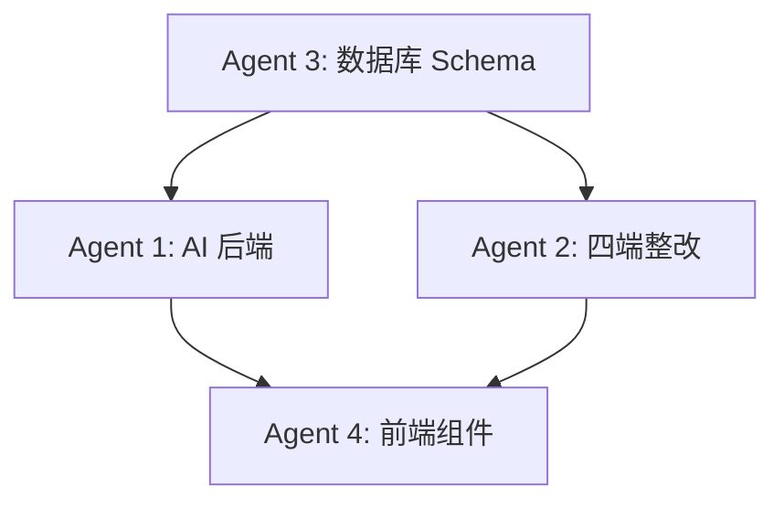

# 启途智学开发任务分配清单

> 生成时间：2025-01-09  
> 项目根目录：//192.168.137.2/科研资产/Study/qitu-zhixue  
> 并行开发策略：4 个独立 Agent 分工协作

---

## 📋 任务总览

| Agent | 任务名称 | 核心产出 | 预计工期 | 优先级 |
|---|---|---|---|---|
| **Agent 1** | AI 搭档后端核心服务 | FastAPI 服务 + LangGraph 编排 | 6-8 周 | P0 |
| **Agent 2** | 四端问题整改 | 19 个缺陷修复 + 统一规范 | 4-6 周 | P0 |
| **Agent 3** | 数据库 Schema 设计与迁移 | PostgreSQL DDL + 存储过程 | 2-3 周 | P0 |
| **Agent 4** | 学生端前端组件库 | React 组件 + Storybook | 4-5 周 | P1 |

---

## 🤖 Agent 1: AI 搭档后端核心服务

### 职责范围
实现《AI搭档功能技术设计文档_v2.0.md》中定义的 AI 搭档核心服务。

### 主要任务
1. **搭建基础架构**（Week 1-2）
   - [ ] 创建 `apps/ai-tutor-service/` FastAPI 项目结构
   - [ ] 配置 LangChain/LangGraph 依赖
   - [ ] 实现 ChatOrchestrator 单一入口
   - [ ] 实现 AgenticChatPipeline 编排引擎
   - [ ] 配置 Redis 会话状态管理

2. **核心能力模块**（Week 3-5）
   - [ ] **Ask Questions**：结构化提问卡生成与分析
   - [ ] **Quiz**：按知识点类型（记忆/程序/概念/设计）出题
   - [ ] **Solve**：分步引导解题（提示等级 1-5）
   - [ ] **Research**：子话题分解 + 多源检索（RAG + 网络搜索）
   - [ ] **Visualize**：概念可视化（图表/动画/交互组件）
   - [ ] **Project Coach**：站会提醒 + 实践指导
   - [ ] **Co-Writer**：选区编辑 + 批注模式

3. **三层记忆系统**（Week 4-6）
   - [ ] L1：工作区实体镜像（projects/tasks/conversations）
   - [ ] L2：阶段摘要抽取（结构化事实 + 证据引用）
   - [ ] L3：综合画像合成（能力/兴趣/学习风格）
   - [ ] 证据链回溯接口

4. **AI 导师矩阵**（Week 5-7）
   - [ ] 定义 4 个导师人格（SOUL.md）
   - [ ] 能力路由器（按项目阶段自动调度）
   - [ ] 多导师会诊机制（consult_subagent）
   - [ ] ask_user 结构化提问

5. **人工介入机制**（Week 6-8）
   - [ ] 触发器：连续失败/情绪信号/安全操作/低置信度/里程碑
   - [ ] 工单数据模型与 API
   - [ ] 班主任通知与工单管理

6. **安全与成本控制**（Week 7-8）
   - [ ] 内容安全过滤（黑名单/分级/自残检测/PII 脱敏）
   - [ ] 工具权限白名单（按阶段控制）
   - [ ] 缓存策略（Redis + 本地 LRU）
   - [ ] 速率限制与成本预算

### 关键产出
```
apps/ai-tutor-service/
├── main.py                    # FastAPI 应用入口
├── core/
│   ├── orchestrator.py        # ChatOrchestrator
│   ├── pipeline.py            # AgenticChatPipeline
│   ├── memory.py              # MemoryManager (L1/L2/L3)
│   ├── handoff.py             # HandoffTrigger
│   └── safety.py              # ContentSafetyFilter
├── capabilities/
│   ├── ask_questions.py
│   ├── quiz.py
│   ├── solve.py
│   ├── research.py
│   ├── visualize.py
│   ├── project_coach.py
│   └── co_writer.py
├── tutors/
│   ├── router.py              # 导师路由
│   └── souls/                 # SOUL.md 人格定义
│       ├── learning_guide.md
│       ├── math_tutor.md
│       ├── project_coach.md
│       └── reviewer.md
├── api/v1/
│   ├── sessions.py
│   ├── messages.py
│   ├── capabilities.py
│   └── memory.py
├── models/
├── schemas/
├── tests/
└── requirements.txt
```

### 验收标准
- [ ] 单个学生完成"兴趣探索 → 理论学习"完整流程
- [ ] 会话可跨页面刷新恢复
- [ ] 连续失败 3 次自动触发班主任工单
- [ ] L3 画像可回溯到 L2/L1 证据
- [ ] 所有能力执行有缓存（命中率 > 60%）
- [ ] 通过 100+ 场景的集成测试

### 技术栈
- FastAPI + Uvicorn
- LangChain + LangGraph
- PostgreSQL (asyncpg)
- Redis (aioredis)
- OpenAI API / Azure OpenAI

---

## 🔧 Agent 2: 四端问题整改

### 职责范围
修复《AI教育平台四端问题整改与功能优化开发文档_v1.0.md》中的 19 个 P0/P1 问题。

### 主要任务

#### 学生端（9 个问题）
- [ ] `STU-UI-001`：顶部问候卡片仅"今天"页显示（P1）
- [ ] `STU-NAV-001`：修复"从一个想法开始"三个按钮入口（P0）
- [ ] `STU-NAV-002`：统一项目深链 `/projects/{project_id}?task_id=...`（P0）
- [ ] `STU-PROJ-001`：修复"会说话的植物观察箱"状态异常（P0）
- [ ] `STU-PROJ-002`：补充"校园垃圾分类"继续按钮（P0）
- [ ] `STU-PROJ-003`：统一项目阶段枚举（P0）
- [ ] `STU-GROW-001`：成长轨迹学习日历 + 指标下钻（P1）
- [ ] `STU-GROW-002`：成长轨迹改为 SPA 标签筛选（P1）
- [ ] `STU-MSG-001`：新增"消息与鼓励"中心（P1）

#### 家长端（3 个问题）
- [ ] `PAR-PROG-001`：修复"成长记录"标签跳转（P0）
- [ ] `PAR-GROW-001`：成长指标明细入口（P1）
- [ ] `PAR-WORK-001`：作品筛选和搜索接通（P1）

#### 班主任端（4 个问题）
- [ ] `TEA-UI-001`：1024px+ 窄屏适配（P2）
- [ ] `TEA-ISSUE-001`：修复"查看全部"404（P0）
- [ ] `TEA-ISSUE-002`：问题统计卡下钻（P1）
- [ ] `TEA-AUTH-001`：移除教师系统设置（P1）

#### 管理员端（2 个问题）
- [ ] `ADM-SEARCH-001`：修复搜索输入刷新问题（P0）
- [ ] `ADM-AI-001`：Provider 与模型配置规范（P1）

### 关键产出

#### 前端改动
```
apps/student-center/
├── app/
│   ├── (student)/
│   │   ├── today/page.tsx          # 问候卡片改为局部组件
│   │   ├── projects/
│   │   │   └── [id]/page.tsx       # 统一项目详情
│   │   ├── growth/page.tsx         # SPA 标签筛选
│   │   └── messages/page.tsx       # 新增消息中心
│   └── components/
│       ├── ProjectCard.tsx         # 统一项目卡片
│       ├── LearningCalendar.tsx    # 学习日历组件
│       └── GreetingCard.tsx        # 问候卡片

apps/parent-companion/
├── app/
│   └── (parent)/
│       ├── progress/page.tsx       # 修复标签切换
│       └── works/page.tsx          # 接通筛选

apps/teacher-workspace/
├── app/
│   └── (teacher)/
│       ├── issues/page.tsx         # 修复路由 + 下钻
│       └── layout.tsx              # 移除系统设置

apps/admin-console/
├── app/
│   └── (admin)/
│       ├── students/page.tsx       # 修复搜索
│       └── ai-config/page.tsx      # Provider 配置流程
```

#### 后端改动
```
# 新增/修改接口
GET  /api/v1/student/today                    # 补齐 project_id/task_id
GET  /api/v1/projects/{id}                    # 统一项目摘要 + next_action
POST /api/v1/tasks/{id}/complete              # 幂等完成
GET  /api/v1/growth/events                    # 筛选 + 分页
GET  /api/v1/growth/calendar                  # 学习日期
GET  /api/v1/works                            # 状态筛选 + 搜索
GET  /api/v1/issues                           # 问题列表筛选
GET  /api/v1/messages                         # 消息中心
POST /api/v1/admin/providers/{id}/test        # Provider 测试
GET  /api/v1/admin/providers/{id}/models      # 模型列表
```

### 验收标准
- [ ] 所有 P0 问题修复（7 个）
- [ ] 核心流程回归测试通过
- [ ] 同一项目在四端显示一致
- [ ] 筛选/搜索无整页刷新
- [ ] 1024×768 分辨率可用
- [ ] 增加操作审计日志

---

## 🗄️ Agent 3: 数据库 Schema 设计与迁移

### 职责范围
设计并实施完整的 PostgreSQL 数据库 Schema，支持 AI 搭档、四端业务和成长记忆。

### 主要任务

#### 核心业务表（Week 1）
- [ ] **用户与权限**
  - `users`（用户基础表）
  - `roles`（角色定义）
  - `user_roles`（用户角色关联）
  - `student_guardian_bindings`（学生-家长绑定）
  - `teacher_class_bindings`（班主任-班级绑定）

- [ ] **项目与任务**
  - `project_templates`（项目模板）
  - `template_stages`（模板阶段定义）
  - `student_projects`（学生项目）
  - `project_stage_records`（阶段流转记录）
  - `tasks`（任务定义）
  - `task_attempts`（任务尝试记录）

#### AI 搭档表（Week 2）
- [ ] **会话与记忆**
  - `ai_tutor_sessions`（AI 会话）
  - `ai_tutor_messages`（对话消息）
  - `capability_executions`（能力执行记录）
  - `memory_l1_entities`（L1 实体镜像）
  - `memory_l2_summaries`（L2 阶段摘要）
  - `memory_l3_profiles`（L3 综合画像）

- [ ] **人工介入**
  - `intervention_requests`（工单表）
  - `intervention_events`（工单事件流）

#### 成长档案表（Week 2）
- [ ] `growth_events`（成长事件）
- [ ] `learning_days`（学习日期）
- [ ] `works`（作品）
- [ ] `work_assets`（作品附件）
- [ ] `messages`（通知）
- [ ] `encouragements`（鼓励留言）
- [ ] `issues`（问题工单）
- [ ] `issue_events`（问题处理流转）

#### AI 配置表（Week 2）
- [ ] `ai_providers`（Provider 配置）
- [ ] `ai_models`（模型定义）
- [ ] `ai_bindings`（模型-业务用途绑定）
- [ ] `audit_logs`（审计日志）

#### 存储过程与触发器（Week 3）
- [ ] `assign_mentor()` - 幂等分配班主任
- [ ] `complete_task()` - 原子完成任务并推进阶段
- [ ] `calculate_project_progress()` - 计算项目进度
- [ ] `trigger_stage_transition()` - 阶段转换触发器
- [ ] `cleanup_expired_sessions()` - 会话清理

### 关键产出
```sql
-- 完整 DDL 文件
migrations/
├── 001_initial_schema.sql
├── 002_ai_tutor_tables.sql
├── 003_growth_tracking.sql
├── 004_ai_config.sql
├── 005_stored_procedures.sql
└── 006_indexes_and_constraints.sql

-- 数据迁移脚本
migrations/data/
├── migrate_existing_projects.sql
├── migrate_user_roles.sql
└── seed_project_templates.sql
```

### 验收标准
- [ ] 所有表结构符合《学生与班主任数据库设计_v1.0.md》规范
- [ ] RLS 策略正确（学生/家长/教师/管理员权限隔离）
- [ ] 存储过程通过单元测试（50+ 场景）
- [ ] 索引优化（查询响应时间 < 100ms）
- [ ] 迁移脚本可回滚
- [ ] 生成 ER 图文档

---

## 🎨 Agent 4: 学生端前端组件库

### 职责范围
开发学生端核心 React 组件，支持 AI 搭档交互和项目式学习。

### 主要任务

#### AI 对话组件（Week 1-2）
- [ ] `<ChatInterface />` - AI 对话主容器
- [ ] `<MessageBubble />` - 消息气泡（学生/AI/系统）
- [ ] `<HintLevelIndicator />` - 提示等级指示器
- [ ] `<AskUserCard />` - 结构化提问卡片
- [ ] `<ToolCallResult />` - 工具调用结果展示
- [ ] `<VoiceInput />` - 语音输入组件
- [ ] `<AttachmentUpload />` - 附件上传

#### 能力交互组件（Week 2-3）
- [ ] `<QuizCard />` - 测验卡片
- [ ] `<SolveWorkspace />` - 解题工作区
- [ ] `<ResearchReport />` - 调研报告展示
- [ ] `<VisualizationFrame />` - 可视化容器
- [ ] `<ProjectCoachPanel />` - 项目教练面板
- [ ] `<CoWriterEditor />` - 协同写作编辑器

#### 项目管理组件（Week 3-4）
- [ ] `<ProjectCard />` - 项目卡片（统一样式）
- [ ] `<StageProgress />` - 阶段进度条
- [ ] `<TaskList />` - 任务列表
- [ ] `<MilestoneTimeline />` - 里程碑时间线
- [ ] `<WorkSubmission />` - 作品提交组件

#### 成长档案组件（Week 4-5）
- [ ] `<GrowthTimeline />` - 成长时间线
- [ ] `<LearningCalendar />` - 学习日历
- [ ] `<SkillRadar />` - 能力雷达图
- [ ] `<EvidenceChain />` - 证据链回溯
- [ ] `<MessageCenter />` - 消息与鼓励中心

### 关键产出
```
packages/ui/
├── src/
│   ├── ai/
│   │   ├── ChatInterface.tsx
│   │   ├── MessageBubble.tsx
│   │   ├── HintLevelIndicator.tsx
│   │   └── ...
│   ├── capability/
│   │   ├── QuizCard.tsx
│   │   ├── SolveWorkspace.tsx
│   │   └── ...
│   ├── project/
│   │   ├── ProjectCard.tsx
│   │   ├── StageProgress.tsx
│   │   └── ...
│   ├── growth/
│   │   ├── GrowthTimeline.tsx
│   │   ├── LearningCalendar.tsx
│   │   └── ...
│   └── index.ts
├── stories/                    # Storybook 文档
├── tests/
└── package.json
```

### 技术栈
- React 18 + TypeScript
- Tailwind CSS (已有设计系统)
- Radix UI (无障碍组件)
- Framer Motion (动画)
- React Hook Form (表单)
- Zustand (状态管理)
- Storybook 7 (组件文档)

### 验收标准
- [ ] 所有组件有 TypeScript 类型定义
- [ ] 通过 WCAG 2.1 AA 级无障碍测试
- [ ] Storybook 文档覆盖所有组件
- [ ] 单元测试覆盖率 > 80%
- [ ] 支持亮色/暗色主题
- [ ] 响应式设计（768px+）

---

## 🔄 协作流程

### 数据依赖


### 里程碑同步
| 里程碑 | 时间 | 交付物 | 依赖 |
|---|---|---|---|
| M1: 数据库就绪 | Week 2 | 核心表 + 存储过程 | Agent 3 |
| M2: AI 基础能力 | Week 4 | Ask Questions + Quiz + 会话管理 | Agent 1 + Agent 3 |
| M3: P0 问题修复 | Week 4 | 7 个 P0 缺陷修复 | Agent 2 + Agent 3 |
| M4: MVP 集成测试 | Week 6 | 端到端流程验证 | All Agents |
| M5: 完整四阶段 | Week 8 | 所有能力 + 三层记忆 | Agent 1 + Agent 4 |
| M6: 规模化就绪 | Week 10 | 性能优化 + 监控 | All Agents |

### 日常协作
- **每日站会**：各 Agent 同步进度（15 分钟）
- **每周评审**：演示可工作的软件
- **共享文档**：
  - API 合同：`docs/api-contracts.yaml`
  - 数据字典：`docs/database-dictionary.md`
  - 设计规范：`docs/design-system.md`
  - 测试用例：`docs/test-scenarios.md`

### 冲突解决
- API 接口变更需三方同意（Agent 1/2/3）
- 数据模型变更需评审（Agent 1/3）
- 组件接口变更需通知（Agent 2/4）

---

## 📊 进度跟踪

使用 GitHub Projects 看板：
- **Backlog**：待认领任务
- **In Progress**：进行中
- **Review**：代码评审
- **Testing**：集成测试
- **Done**：已完成

每个任务使用 Issue 跟踪，标签：
- `agent-1` / `agent-2` / `agent-3` / `agent-4`
- `p0-critical` / `p1-high` / `p2-medium`
- `backend` / `frontend` / `database`
- `blocked` / `needs-review`

---

## 🚀 启动命令

### Agent 1 启动
```bash
cd apps/ai-tutor-service
python -m venv venv
source venv/bin/activate  # Windows: venv\Scripts\activate
pip install -r requirements.txt
uvicorn main:app --reload --port 8001
```

### Agent 2 + Agent 4 启动
```bash
# 前端开发环境
pnpm install
pnpm dev  # 启动所有 apps
```

### Agent 3 启动
```bash
# 数据库迁移
cd migrations
psql -U postgres -d qitu_zhixue -f 001_initial_schema.sql
```

---

## ✅ 完成定义

单个任务只有同时满足以下条件才可标记完成：
1. 代码实现完成并通过 lint/typecheck
2. 单元测试覆盖率达标
3. API 合同对齐（前后端）
4. 集成测试通过
5. 代码评审通过（至少 1 人）
6. 文档更新（API/组件/数据库）
7. 无遗留 P0/P1 缺陷

---

**文档版本**：v1.0  
**生成时间**：2025-01-09  
**下一步**：创建 GitHub Issues → 分配 Agent → 启动开发
